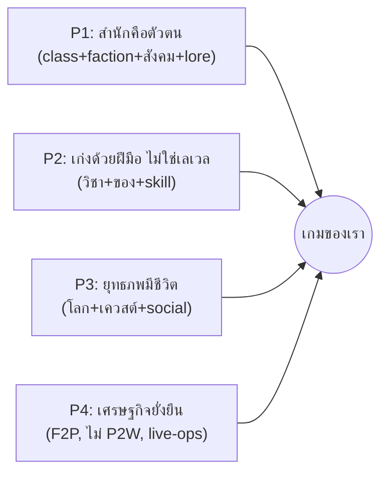
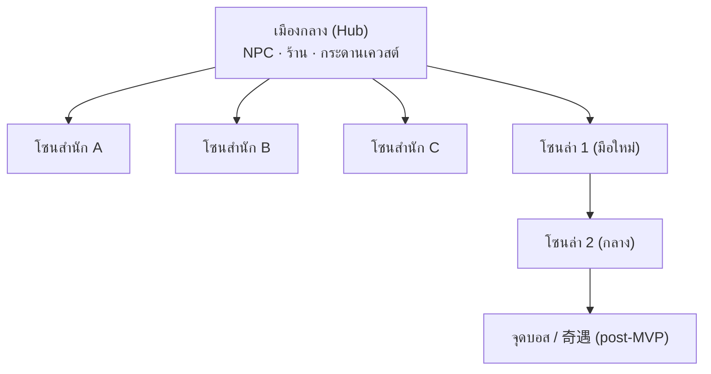
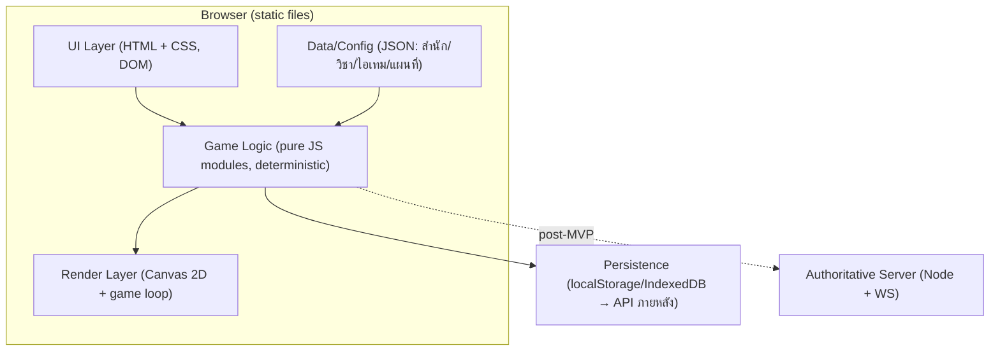
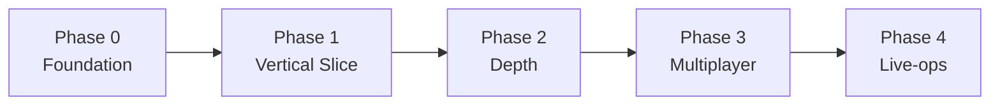
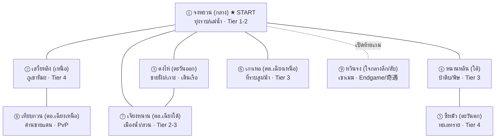
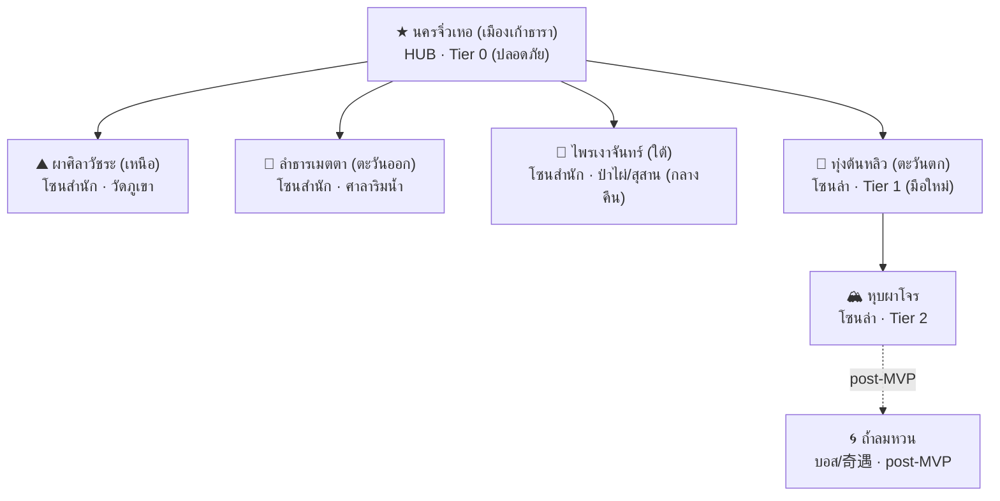
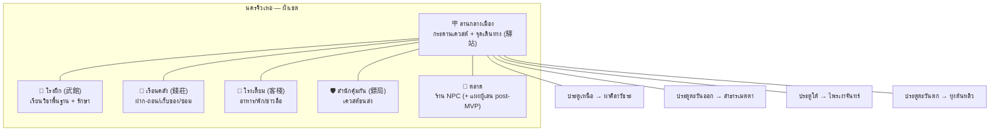

# วิถีพยัคฆ์ — Game Design Document (v0.1 / Foundation)

> [!info] เอกสารนี้คืออะไร
> GDD ฉบับแรกของ **เกมเราเอง** — MMO กำลังภายใน 2D isometric บนเว็บ
> แปลงข้อมูลอ้างอิงจาก [[jy-online-gdd-reference]] (งานวิจัย JY Online) มาเป็น "ดีไซน์ที่ตัดสินใจแล้ว"
> เป้าหมายของ v0.1: **วางรากฐานที่ขยายต่อได้** + กำหนด **vertical slice แรก** ให้ทีมเล็กทำได้จริง

> [!warning] เรื่องลิขสิทธิ์ — ออกแบบโลกของเราเอง
> เกมนี้ **ไม่ใช้ IP กิมย้ง / ชื่อนิยาย / ชื่อสำนักจริง** เราหยิบเฉพาะ *กลไกการออกแบบ* และ *อารมณ์ยุทธภพ*
> ชื่อโลก สำนัก ตัวละครตำนาน และวิชาทั้งหมด เป็นของเราเอง (ดูภาคผนวก A — naming)

---

## สารบัญ
1. [Vision & Positioning](#1-vision--positioning)
2. [Design Pillars](#2-design-pillars)
3. [เสาหลัก 1 — Combat & วิชา](#3-เสาหลัก-1--combat--วิชา)
4. [เสาหลัก 2 — ระบบสำนัก (Sect)](#4-เสาหลัก-2--ระบบสำนัก-sect)
5. [เสาหลัก 3 — โลก & การเดิน/เควสต์](#5-เสาหลัก-3--โลก--การเดินเควสต์)
6. [เสาหลัก 4 — เศรษฐกิจ & Progression](#6-เสาหลัก-4--เศรษฐกิจ--progression)
7. [ส่วนเทคนิค & Data Model](#7-ส่วนเทคนิค--data-model)
8. [Roadmap เป็นเฟส](#8-roadmap-เป็นเฟส)
9. [ความเสี่ยง & สิ่งที่ต้องตัดสินใจต่อ](#9-ความเสี่ยง--สิ่งที่ต้องตัดสินใจต่อ)
10. [ขั้นต่อไป (actionable)](#10-ขั้นต่อไป-actionable)
- [ภาคผนวก A — Naming เกมของเรา](#ภาคผนวก-a--naming-เกมของเรา)
- [ภาคผนวก B — ออกแบบแผนที่ทั้งหมด (World Map & Zones)](#ภาคผนวก-b--ออกแบบแผนที่ทั้งหมด-world-map--zones)

---

## 1. Vision & Positioning

> **"ก้าวเข้าสู่ยุทธภพ เลือกสำนัก ฝึกวิชา และเขียนตำนานของตัวเองในโลกที่เปิดเล่นได้จากเบราว์เซอร์"**

- **Genre:** MMORPG กำลังภายใน (Wuxia) 2D isometric, เล่นบนเว็บ (ไม่ต้องติดตั้ง)
- **Fantasy หลัก:** ผู้เล่นคือจอมยุทธ์ที่ค่อยๆ เก่งขึ้น "จากฝีมือและตัวตน" ไม่ใช่จากแถบเลเวล
- **Hook (เหตุผลที่คนเลือกเล่นเรา):**
  1. **สำนัก = ตัวตน** — เลือกสำนักแล้วได้ทั้งวิชา สังคม และจุดยืนทางคุณธรรมในเรื่องเดียว
  2. **ไม่มีเลเวลตัวละคร** — ความเก่งวัดจากวิชา + อุปกรณ์ + ฝีมือจริง (skill ceiling สูง)
  3. **เล่นจากเบราว์เซอร์ทันที** — ลดแรงเสียดทานการเข้าเล่นเทียบ MMO ติดตั้งหนัก
- **กลุ่มเป้าหมาย:** แฟนเกมกำลังภายใน/wuxia, ผู้เล่น MMO สาย social/PvP, ผู้เล่น casual ที่อยากได้เกมเปิดเล่นเร็ว

> [!tip] บทเรียนที่ยึดจาก reference (สรุป)
> JY Online อยู่ได้ 20+ ปีเพราะ **ดีไซน์ + content + community + live-ops** ไม่ใช่กราฟิก
> และ "ตาย" ในไทยเพราะการบริหารจัดการ → เราออกแบบโดยถือว่า **live-ops/เศรษฐกิจคือเรื่องเป็นเรื่องตาย**

### สิ่งที่ตั้งใจ "ตัด/ปรับ" จาก JY Online ตั้งแต่ต้น
| ของเดิมใน JY Online | การตัดสินใจของเรา | เหตุผล |
|---|---|---|
| เงื่อนไขปลดวิชา "ออนไลน์ 3,000–5,200 ชม." | **ตัดทิ้ง** ใช้เงื่อนไขเชิงความสำเร็จแทน (เควสต์/ฝีมือ/สะสม in-game) | กดดัน casual + ส่งเสริม bot/macro |
| ขายวิชาแรงใน cash shop (P2W) | **ตัด** ขายเฉพาะ cosmetic + convenience | ยั่งยืนกว่า, ชุมชนไม่แตก |
| เปลี่ยน core combat กลางคัน (เทิร์น→เรียลไทม์) | **เลือกระบบเดียวตั้งแต่ต้น** (ดู §3) | เปลี่ยน core = ความเสี่ยงสูงสุด |
| 14 สำนัก + วิชานับร้อยตั้งแต่เปิด | **เริ่ม 3 สำนักใน slice แรก** ขยายเป็นชุด | scope จริงของทีมเล็ก |
| ฝึกวิชา 24 ชม. / grind หนัก | **QoL ตั้งแต่แรก** (auto-rest, ฝึกแบบ session สั้น) | รองรับผู้เล่นยุคใหม่ |

---

## 2. Design Pillars

ทุกการตัดสินใจดีไซน์ต้องผ่าน 4 เสานี้:



1. **สำนักคือตัวตน** — ระบบสังกัดเป็นแกนกลาง รวม class + faction + สังคม + lore
2. **เก่งด้วยฝีมือ ไม่ใช่เลเวล** — progression ผูกกับวิชา/อุปกรณ์/ความชำนาญ
3. **ยุทธภพมีชีวิต** — โลกที่มีสถานที่ในตำนาน เควสต์อิงเนื้อเรื่อง และปฏิสัมพันธ์ผู้เล่น
4. **เศรษฐกิจยั่งยืน** — F2P ที่ไม่ P2W, sink/source ชัด, ออกแบบกัน RMT/บอทตั้งแต่ต้น

---

## 3. เสาหลัก 1 — Combat & วิชา

### 3.1 การตัดสินใจหลัก: ระบบต่อสู้แบบ "เรียลไทม์เชิงยุทธวิธี (Tactical Real-time)"

> [!important] เลือก **เรียลไทม์ + ยุทธวิธี** (ไม่ใช่เทิร์นเบส, ไม่ใช่ action ไล่ฟันมั่ว)
> เคลื่อนที่/เล็งแบบเรียลไทม์ + สกิลมี cooldown + การวางตำแหน่ง/จังหวะ/คอมโบมีผลจริง

**เหตุผล:**
- ตรงกับ "feel" ที่ผู้เล่น JY Online ชื่นชม (เรียลไทม์ + วางหมาก, hit-stun, คอมโบ) — `[อิงรีวิวจาก reference]`
- ให้ **skill expression** สอดคล้อง Pillar 2 (เก่งด้วยฝีมือ)
- ทำบนเว็บด้วย Canvas 2D (vanilla) ได้จริง และยังเป็น **deterministic-friendly** พอสำหรับ networking ภายหลัง
- หลีกเลี่ยงกับดักของ JY (เปลี่ยน core กลางคัน) — เราเลือกอันเดียวแล้วยึด

**กติกาแกนของ combat:**
- ตัวละครมี **HP (氣血) + Stamina/ลมปราณ (內力)** — สกิลภายในกิน 內力, การวิ่ง/หลบกิน stamina
- ทุกการโจมตีมี **น้ำหนักการกระทบ (hit-stun/stagger)** ต่างกันตามชนิดอาวุธ-สกิล → "ฟีลหนักแน่น"
- **คอมโบ:** สกิลบางตัวต่อเนื่องกันได้ถ้ากดในจังหวะ (timing window) → ให้รางวัลฝีมือ
- **การวางตำแหน่ง:** สกิล AoE/ทิศทาง ทำให้การเดินหลบ/เข้าทำมีความหมาย
- ไม่มี auto-combat บังคับ แต่มี **assist mode (QoL)** สำหรับ grind เบาๆ (เปิด/ปิดได้)

### 3.2 วิชา 3 ประเภท (ยึดจาก reference, ปรับให้คม)
| ประเภท | บทบาท | ตัวอย่างกลไก |
|---|---|---|
| **วิชาฝีมือ/อาวุธ (外功)** | ดาเมจหลัก, ผูกกับอาวุธ | หมัด, กระบี่, ดาบ — แต่ละชนิดมี moveset |
| **วิชาภายใน (內功)** | บัฟ/ทรัพยากร/สถานะ | เพิ่ม 內力 สูงสุด, ฟื้นฟู, ลดดาเมจ, ปลดล็อกพลังพิเศษ |
| **วิชาตัวเบา (輕功)** | เคลื่อนที่/หลบ | พุ่ง (dash), เพิ่มความเร็ว, หลบสุ่ม, เข้าถึงพื้นที่ลับ |

**กฎจับคู่อาวุธ-วิชา (ยึดจาก reference):** วิชาหมัด→มือเปล่า/กรงเล็บ, วิชากระบี่→กระบี่, วิชาดาบ→ดาบ
→ การเปลี่ยนอาวุธ = เปลี่ยน playstyle จริง (ไม่ใช่แค่ตัวเลข)

### 3.3 Progression ที่ไม่ผูกกับเลเวลตัวละคร

> [!important] **ไม่มีเลเวลตัวละคร** — power = ระดับวิชา + อุปกรณ์ + ประสบการณ์รบจริง
> ยึดจุดเด่นที่สุดของ JY Online ไว้ เป็นตัวสร้างเอกลักษณ์

- **แต้มเรียนวิชา (Skill Points)** — ได้จากล่ามอนสเตอร์/เควสต์ ใช้ยกระดับวิชา
- **ประสบการณ์รบ (Combat XP)** — สะสมจากการสู้จริง เป็น gate ของวิชาขั้นสูง
- **ระดับวิชา (Skill Rank)** — แต่ละวิชาไต่ rank ของตัวเอง (เช่น 1→10) เพิ่มพลัง/ปลด moveset
- **Hidden stats (ขยายภายหลัง):** ปัญญา/วาสนา/พรสวรรค์ ฯลฯ เป็นเงื่อนไขปลดวิชาตำนาน (post-MVP)

### 3.4 Chase items ปลายเกม (post-MVP, ออกแบบ hook ไว้ตั้งแต่ตอนนี้)
- **วิชาชั้นสูงนอกสำนัก** — หาได้นอกระบบ class ปกติ, เป็น long-term goal
- ช่องทางได้มาแบบ **奇遇 (เหตุการณ์สุ่มบังเอิญ)** → สร้างตำนานปากต่อปาก/community
- **gating หลายชั้น** ด้วย achievement in-game (ไม่ใช่ชั่วโมงออนไลน์)

### 3.5 ขอบเขต Combat — MVP vs ขยายต่อ
| อยู่ใน slice แรก (MVP) | กันไว้ขยายภายหลัง |
|---|---|
| เรียลไทม์เชิงยุทธวิธี 1 ชุดกติกา | คอมโบขั้นสูง / cancel ขั้นสูง |
| วิชา 3 ประเภท, อาวุธ 2-3 ชนิด | วิชาตำนานนอกสำนัก + hidden stats |
| 8-12 วิชาต่อสำนัก × 3 สำนัก | ระบบแกนใน 5 ธาตุ / เซียนเปลี่ยน |
| hit-stun พื้นฐาน, cooldown, 內力 | PvP combat balancing เชิงลึก |

> [!tip] 💡 Takeaway เสาหลัก 1
> ✅ เรียลไทม์+ยุทธวิธี, ไม่มีเลเวล, วิชา 3 ประเภทผูกอาวุธ — ตัดสินใจชัดและยึดยาว
> ⚠️ ต้องคุม scope จำนวนวิชาใน MVP ให้ balance ได้จริง

---

## 4. เสาหลัก 2 — ระบบสำนัก (Sect)

### 4.1 สำนัก = class + faction + สังคม + lore (แกนกลางของเกม)
ยึดจุดขายหลักของ reference: สำนักไม่ใช่แค่ class แต่เป็นตัวตนของผู้เล่น

**แต่ละสำนักประกอบด้วย:**
- **วิชาเด่น/สไตล์การเล่น** (combat identity)
- **ค่าคุณธรรม/identity เฉพาะตัว** (เช่น ใจสงบ / เมตตา / ปราบความชั่ว) — gate การเรียนวิชาบางส่วน
- **Art direction** (เครื่องแต่งกาย, สถาปัตยกรรมสำนัก, สี)
- **จุดยืนในโลก** (พันธมิตร/ศัตรูตามธรรมชาติ → เชื้อเพลิง PvP/เนื้อเรื่อง)

### 4.2 สามสำนักตัวอย่าง (slice แรก) — ของเราเอง
> ออกแบบให้ครอบ archetype สามขั้ว: บุก / ตั้งรับ-สนับสนุน / คล่องแคล่ว-ลอบ

| สำนัก (working name) | Archetype | วิชาเด่น | ค่า identity | Art direction |
|---|---|---|---|---|
| **สำนักศิลาวัชระ (Vajra Cliff)** | บุก/ทนทาน (หมัด) | หมัดกระแทก AoE, เกราะลมปราณ | **ค่าวิริยะ (Resolve)** — ได้จากการยืนหยัดในศึก | ผ้าคลุมหินเทา, วัดภูเขา, โทนน้ำตาล-ทอง |
| **สำนักธารเมตตา (Mercy Stream)** | สนับสนุน/รักษา | ฝ่ามือฟื้นฟู, บัฟกลุ่ม, ลดสถานะร้าย | **ค่าเมตตา (Compassion)** — ได้จากช่วยผู้เล่น/ช่วยเหลือ NPC | ชุดขาว-ฟ้า, ศาลาน้ำ, โทนสว่างเย็น |
| **สำนักเงาพระจันทร์ (Moonshade)** | คล่อง/ลอบโจมตี (กระบี่) | กระบี่เร็ว, dash, พิษ/หลบสุ่มสูง | **ค่าใจสงบ (Serenity)** — ได้จากภารกิจเดี่ยว/ความแม่นยำ | ชุดดำ-เงิน, สุสาน/ป่าไผ่กลางคืน |

> [!note] ทำไม "ค่า identity ผูกกับการฝึกวิชา" (ยึดจาก reference)
> progression ผูกกับ **บทบาท/จริยธรรม** ของสำนัก ไม่ใช่แค่ฟาร์ม XP
> เช่น Mercy Stream ต้องสะสม "ค่าเมตตา" (ช่วยคนอื่นจริงในเกม) จึงเรียนวิชาขั้นสูงได้ → พฤติกรรมตรงกับ lore

### 4.3 กลไกสำนัก (MVP)
- **เข้าสำนัก:** เลือกได้หลังเควสต์มือใหม่ (บางสำนักมีเงื่อนไข — ขยายภายหลัง)
- **เรียนวิชา:** จากอาจารย์สำนัก (NPC) ใช้ Skill Points + ค่า identity
- **ความเป็นศิษย์:** ฝึกวิชาถึง rank สูงสุด → เป็นศิษย์ถาวร → ปลดวิชาแก่นแท้ (post-MVP: daily loop)
- **เปลี่ยนสำนัก:** มี NPC ช่วย (มี cost) — กันการสลับพร่ำเพรื่อ

### 4.4 ขอบเขต Sect — MVP vs ขยายต่อ
| MVP | ขยายภายหลัง |
|---|---|
| 3 สำนัก, เข้า/เรียนวิชา/ค่า identity | เพิ่มเป็น 8-14 สำนัก เป็นชุด (content patch) |
| อาจารย์สำนัก + วิชาสำนัก | ตั้งสำนักเอง / คิดวิชาเอง (sandbox) |
| ความสัมพันธ์สำนักแบบ lore (static) | สงครามสำนัก / ระบบประลอง 2 สาย |

> [!tip] 💡 Takeaway เสาหลัก 2
> ✅ 3 สำนักครอบ 3 archetype + ค่า identity ที่ผูกพฤติกรรมกับ lore
> ✅ ออกแบบ data ของสำนักให้ "เพิ่มสำนักใหม่ = เพิ่ม config" ไม่ใช่แก้โค้ด (ดู §7)

---

## 5. เสาหลัก 3 — โลก & การเดิน/เควสต์

### 5.1 โครงสร้างโลก 2D isometric
> 📍 **ผังแผนที่ทั้งหมด (โลก 9 มณฑล + มณฑลเริ่มต้น + ผังเมือง + ZoneDef JSON)** อยู่ใน [ภาคผนวก B](#ภาคผนวก-b--ออกแบบแผนที่ทั้งหมด-world-map--zones)
- **มุมมอง:** 2D isometric (เฉียงกดลง) — ยึดจาก reference, วาดด้วย Canvas 2D บนเว็บ
- **โครงแผนที่:** โลกแบ่งเป็น **โซน (zone)** เชื่อมกันด้วยทางออก (portal/edge)
  - **เมืองกลาง (hub)** — NPC, ร้านค้า, กระดานเควสต์, จุดเดินทาง
  - **โซนสำนัก** — ที่ตั้งของแต่ละสำนัก (อาจารย์, ลานฝึก)
  - **โซนล่า (field)** — มอนสเตอร์, ทรัพยากร, จุด 奇遇 (ขยายภายหลัง)
- **ระบบเดิน:** คลิกเพื่อเดิน (point-to-click) + pathfinding บน tile grid; วิชาตัวเบาเพิ่มความเร็ว/ลัด
- **บรรยากาศ (ยึดจาก reference):** ระบบสภาพอากาศ (เช่น ฝน) เป็น polish เพิ่ม immersion (post-MVP)



### 5.2 NPC & เควสต์
- **ประเภทเควสต์ (ยึดจาก reference):**
  - **เควสต์เมือง** — ทำความรู้จักโลก, สอนระบบ (onboarding)
  - **เควสต์สำนัก** — ผูกกับ identity/วิชาของสำนัก, ปลด progression
  - **เควสต์ยุทธภพ** — เนื้อเรื่องหลักของโลกเรา (เครือข่ายตัวละครตำนานของเราเอง)
- **เส้นทางมือใหม่ (onboarding):** เข้าเกม → เรียนพื้นฐาน (NPC) → ล่ามอนแรก → เลือกสำนัก → เรียนวิชาเด่น
  - ยึดบทเรียน reference: onboarding ละเอียด = retention

### 5.3 ขอบเขต World — MVP vs ขยายต่อ
| MVP | ขยายภายหลัง |
|---|---|
| 1 เมือง hub + 3 โซนสำนัก + 2 โซนล่า | แผนที่ "สถานที่ในตำนาน" จำนวนมาก |
| point-to-click + pathfinding | พาหนะ (ม้า/เรือ), เดินเรือ |
| เควสต์เมือง/สำนัก/ยุทธภพ (สายสั้น) | เควสต์เชน NPC ดัง, 奇遇 สุ่ม |
| NPC ร้าน/อาจารย์/เควสต์ | สภาพอากาศ, sandbox (บ้าน/แต่งงาน) |

> [!tip] 💡 Takeaway เสาหลัก 3
> ✅ โครงโซนแบบ hub-and-spoke → เพิ่มโซน/สำนักใหม่ได้โดยไม่กระทบของเดิม
> ✅ เควสต์ 3 ประเภทผูกกับ onboarding และ identity สำนัก

---

## 6. เสาหลัก 4 — เศรษฐกิจ & Progression

### 6.1 โมเดลรายได้: F2P ไม่ P2W (ตัดสินใจตั้งแต่ต้น)
> [!important] เริ่มที่ **F2P + cosmetic/convenience** เลย — เลี่ยงประวัติศาสตร์ P2W ของ reference
> ขายความสะดวก/ความสวย ไม่ขายพลัง: ของในร้านต้องหาเทียบเท่าได้ในเกม (บทเรียน 至尊版)

- **ขายได้:** cosmetic (สกิน/ชุด/บ้าน), convenience (ช่องเก็บของ, ฝึกเร็วขึ้นเล็กน้อย, VIP QoL)
- **ห้ามขาย:** วิชาแรง, ค่าพลังตรงๆ, ของที่กระทบ balance PvP

### 6.2 สกุลเงิน & Sink/Source
| | รายการ |
|---|---|
| **สกุลเงิน** | เงินในเกม (soft) + เหรียญพรีเมียม (hard, เฉพาะ cosmetic/convenience) |
| **Source** | ทำงาน/อาชีพ, ดรอปมอนสเตอร์, ฟาร์มอุปกรณ์ขายตลาด, รางวัลเควสต์ |
| **Sink** | ค่าเรียนวิชา, ซ่อม/อัปเกรดอุปกรณ์, ค่าเปลี่ยนสำนัก, บ้าน/ตกแต่ง (post-MVP) |

> [!important] ออกแบบ sink/source ให้สมดุลตั้งแต่ต้น (บทเรียนเงินเฟ้อ/บอท)
> ทุก source ต้องมี sink รองรับ; ของที่ฟาร์มได้ไม่จำกัดต้องมีทางถูกดูดออกจากระบบ

### 6.3 กัน RMT / บอท ตั้งแต่ออกแบบ
- คาดการณ์ตลาดซื้อขายนอกเกม (RMT) ตั้งแต่แรก (บทเรียน reference)
- มาตรการ: ระบบ trade ในเกมที่ track ได้, sink ที่ดูดเงินส่วนเกิน, rate-limit การฟาร์ม, ตรวจจับ pattern บอท, ผูกบัญชี
- assist mode ทำให้ "ไม่ต้องใช้บอท" → ลดแรงจูงใจสร้างบอท

### 6.4 ขอบเขต Economy — MVP vs ขยายต่อ
| MVP | ขยายภายหลัง |
|---|---|
| 1 สกุลเงิน soft + sink/source พื้นฐาน | เหรียญพรีเมียม + cash shop |
| ดรอป/รางวัลเควสต์, ร้าน NPC | ตลาดผู้เล่น (auction), อาชีพ/crafting |
| ค่าเรียนวิชา/ซ่อมเป็น sink | บ้าน/อสังหา, แต่งงาน (sandbox sink) |

> [!tip] 💡 Takeaway เสาหลัก 4
> ✅ F2P ไม่ P2W เป็นกฎเหล็ก, sink/source วางล่วงหน้า, กัน RMT/บอทตั้งแต่ดีไซน์
> ⚠️ เศรษฐกิจ + live-ops คือปัจจัยอยู่รอด — ต้องมีคนดูแลตัวเลขต่อเนื่อง

---

## 7. ส่วนเทคนิค & Data Model

### 7.1 Tech stack
> [!important] **Vanilla stack** — HTML + CSS + JavaScript (ES modules) ล้วน ไม่มี framework / build tool
> เป้าหมาย: เปิดเล่นจากเบราว์เซอร์ได้ทันที, dependency เป็นศูนย์, เข้าใจง่าย, ขยายต่อได้

- **Markup/UI:** **HTML + CSS** — เมนู, HUD, หน้าต่าง (inventory, เรียนวิชา, ร้านค้า) เป็น DOM/CSS
- **Rendering เกม:** **Canvas 2D API** (vanilla) — วาด isometric tilemap, sprites, เอฟเฟกต์เอง ผ่าน game loop (`requestAnimationFrame`)
- **Logic:** **JavaScript (ES modules)** — `import/export` แบบ native (ไม่มี bundler), เสิร์ฟเป็น static files
- **Type safety (เลือกใช้):** **JSDoc typedef + `// @ts-check`** ให้ editor ช่วยตรวจ type ได้โดยไม่ต้อง compile (ดู §7.3)
- **Persistence (MVP):** `localStorage` / `IndexedDB` — เล่น single-player/offline ก่อน
- **Server (post-MVP):** Node.js + WebSocket, authoritative server; เขียน logic เป็น JS module ที่รันได้ทั้ง browser และ Node → ย้ายขึ้น server ได้

> [!note] ผลจากการเลือก vanilla (ต้องรับรู้)
> - **ไม่มี Phaser** → เราเขียน game loop, การจัดการ sprite/tilemap, input, camera, การชน เอง (งานมากขึ้นใน Phase 0 แต่ควบคุมได้เต็มที่ + ไม่มี dependency)
> - **ไม่มี build step** → เสิร์ฟ static ได้เลย (`python -m http.server` / live-server / GitHub Pages); ต้องใช้ ES modules ผ่าน `<script type="module">` (ต้องเปิดผ่าน http ไม่ใช่ `file://`)
> - **ไม่มี TS compile** → ใช้ JSDoc แทน interface; วินัยการแยกโมดูลสำคัญกว่าเดิม

### 7.2 สถาปัตยกรรม (เริ่ม single-player → ขยายเป็น MMO)


> [!important] หลักการที่ทำให้ "ขยายต่อได้" (สำคัญเป็นพิเศษเมื่อไม่มี framework)
> 1. **Logic แยกจาก render** — combat/economy เป็น **pure JS functions** (ไม่แตะ DOM/Canvas), ทดสอบได้, รันบน Node ได้ → ย้ายขึ้น server ได้
> 2. **Data-driven** — สำนัก/วิชา/ไอเทม/แผนที่ เป็น **config (JSON)** ไม่ hardcode → เพิ่มเนื้อหา = เพิ่มไฟล์ data (รองรับ content patch แบบ reference)
> 3. **ECS-lite** — entity (player/mob/npc) เป็น plain object ที่ประกอบจาก component → เพิ่มพฤติกรรมใหม่ได้ยืดหยุ่น
> 4. **UI = DOM, เกม = Canvas** — แยกชัด: HUD/เมนู/หน้าต่างทำด้วย HTML+CSS (จัด layout ง่าย, เข้าถึงง่าย), ฉากเกมวาดบน Canvas เลเยอร์เดียว

### 7.3 Data Model หลัก (ร่าง — JSDoc typedef)
> เขียนเป็น **JSDoc** ใน `.js` ธรรมดา → ได้ autocomplete/type-check ใน editor (เปิด `// @ts-check`) โดยไม่ต้อง compile
> `*Def` = config (โหลดจาก JSON) · instance = runtime state

```js
// @ts-check

// ---------- Sect ----------
/**
 * @typedef {Object} SectDef
 * @property {string} id                 // "vajra_cliff"
 * @property {string} name               // "สำนักศิลาวัชระ"
 * @property {"bruiser"|"support"|"skirmisher"} archetype
 * @property {IdentityStatDef} identityStat   // ค่าคุณธรรมเฉพาะสำนัก
 * @property {WeaponType[]} weaponTypes        // อาวุธที่ใช้ได้
 * @property {string[]} skillIds               // วิชาของสำนัก (อ้างถึง SkillDef.id)
 * @property {{ palette: string, outfit: string, architecture: string }} art
 */

/**
 * @typedef {Object} IdentityStatDef
 * @property {string} id                 // "resolve" | "compassion" | "serenity"
 * @property {string} name               // "ค่าวิริยะ"
 * @property {string[]} gainFrom         // เงื่อนไขได้ค่า เช่น "heal_ally", "kill_bandit"
 */

// ---------- Skill ----------
/**
 * @typedef {Object} SkillDef
 * @property {string} id
 * @property {string} name
 * @property {"external"|"internal"|"movement"} type   // 外功/內功/輕功
 * @property {WeaponType=} weaponType    // ต้องคู่กับอาวุธ (สำหรับ external)
 * @property {number} maxRank
 * @property {SkillRank[]} ranks         // ค่าพลังต่อ rank
 * @property {SkillRequirement} requirements  // skillPoints, combatXP, identityStat, prereqSkillIds
 * @property {number} hitStun            // น้ำหนักการกระทบ
 * @property {number} cooldownMs
 * @property {number} staminaCost        // 內力
 */

// ---------- Character (instance / runtime state) ----------
/**
 * @typedef {Object} Character
 * @property {string} id
 * @property {string|null} sectId
 * // ไม่มี level! power มาจากด้านล่าง:
 * @property {Object<string, { rank: number }>} skills
 * @property {number} skillPoints
 * @property {number} combatXP
 * @property {Object<string, number>} identityStats   // resolve/compassion/...
 * @property {EquipmentSlots} equipment
 * @property {number} hp                 // 氣血
 * @property {number} stamina            // 內力
 * @property {ItemStack[]} inventory
 * @property {{ soft: number, premium: number }} currency
 */

// ---------- World ----------
/**
 * @typedef {Object} ZoneDef
 * @property {string} id
 * @property {string} name
 * @property {"hub"|"sect"|"field"} type
 * @property {string} tilemapRef         // ไฟล์ tilemap (JSON)
 * @property {{ toZoneId: string, at: TilePos }[]} exits
 * @property {NpcSpawn[]} npcs
 * @property {MobSpawn[]=} spawns         // field zones
 */

/**
 * @typedef {Object} QuestDef
 * @property {string} id
 * @property {"city"|"sect"|"jianghu"} category
 * @property {QuestStep[]} steps
 * @property {{ skillPoints?: number, soft?: number, itemIds?: string[] }} rewards
 * @property {{ sectId?: string, prereqQuestIds?: string[] }=} requirements
 */
```

> [!note] ทำไม model นี้รองรับการขยาย
> - เพิ่มสำนักใหม่ = เพิ่ม `SectDef` + วิชา (JSON) ไม่แตะโค้ด combat
> - `Character` ไม่มี `level` → ยึด Pillar 2 ตั้งแต่ schema
> - `ZoneDef.exits` = ต่อโซนใหม่เข้ากับโลกเดิมได้อิสระ (hub-and-spoke)
> - แยก `*Def` (config) ออกจาก instance (runtime state) ชัดเจน
> - JSDoc ทำให้ได้ความปลอดภัยของ type ส่วนใหญ่ของ TS โดยคง stack vanilla (ไม่มี build)

### 7.4 โครงไฟล์/โมดูลที่แนะนำ
```
index.html         # entry: <canvas> + UI containers, <script type="module" src="src/main.js">
styles/
  ui.css           # HUD, เมนู, หน้าต่าง (inventory/เรียนวิชา/ร้าน)
src/
  core/            # pure JS game logic (ทดสอบได้, ไม่แตะ DOM/Canvas)
    combat.js      # resolve hits, cooldown, hit-stun, combo
    skills.js      # ระบบเรียน/ไต่ rank วิชา
    sect.js        # logic สำนัก + identity stats
    economy.js     # sink/source, currency, trade rules
    progression.js # skill points, combat XP, requirements
  render/          # วาดด้วย Canvas 2D
    loop.js        # game loop (requestAnimationFrame), เวลา/เฟรม
    camera.js      # isometric projection + viewport
    tilemap.js     # วาด tilemap isometric
    sprites.js     # วาด/อนิเมต player/mob/npc
  ui/              # ผูก DOM (HTML+CSS) เข้ากับ state
    hud.js
    panels.js      # inventory, เรียนวิชา, ร้านค้า
  input/           # mouse/keyboard → คำสั่งเกม (point-to-click)
  state/           # persistence (localStorage/IndexedDB), save/load
  net/             # (post-MVP) WebSocket client, sync
  types.js         # JSDoc typedefs รวม (ดู §7.3)
  main.js          # bootstrap: โหลด data, สร้าง loop, ผูก UI
data/              # config JSON (สิ่งที่ designer แก้ได้)
  sects/*.json
  skills/*.json
  items/*.json
  zones/*.json
  quests/*.json
assets/            # sprites, tilesets, sfx
tests/             # unit tests ของ core/ (รันด้วย node --test, vanilla)
```

> [!tip] กฎเหล็ก: `render/`, `ui/`, `net/` พึ่ง `core/` ได้ แต่ `core/` **ห้าม** พึ่ง DOM/Canvas/`window`
> → `core/` เป็น JS module ล้วน รันบน Node ได้ → ย้ายขึ้น authoritative server ได้ทันทีตอนทำ MMO
> รันโลคัลด้วย static server ใดก็ได้ (เช่น `python3 -m http.server`) แล้วเปิด `http://localhost:8000`

---

## 8. Roadmap เป็นเฟส



### Phase 0 — Foundation (รากฐาน)
- ตั้งโปรเจกต์ vanilla (`index.html` + `<canvas>` + ES modules), โครงไฟล์ตาม §7.4
- เขียน game loop (`requestAnimationFrame`) + isometric camera/projection เอง
- วาง data schema (JSDoc) + loader (fetch JSON config)
- render tilemap isometric + เดินตัวละคร (point-to-click + pathfinding)
- **เกณฑ์ผ่าน:** เปิดผ่าน static server แล้วเดินตัวละครในโซนเดียวบนแผนที่ isometric ได้

### Phase 1 — Vertical Slice (สิ่งที่ user ขอเป็น slice แรก)
ครอบ **ทั้ง 4 เสาหลักในระดับ MVP**:
- **Combat:** เรียลไทม์เชิงยุทธวิธี, วิชา 3 ประเภท, hit-stun/cooldown/內力, อาวุธ 2-3 ชนิด
- **Sect:** 3 สำนัก, เข้าสำนัก, เรียนวิชาจากอาจารย์, ค่า identity พื้นฐาน
- **World:** 1 hub + 3 โซนสำนัก + 2 โซนล่า, NPC, เควสต์ 3 ประเภท (สายสั้น), onboarding
- **Economy/Progression:** soft currency, sink/source พื้นฐาน, skill points + combat XP, ร้าน NPC
- persistence แบบ local (เล่นจบลูปได้คนเดียว)
- **เกณฑ์ผ่าน:** ผู้เล่นใหม่ → ทำเควสต์ → เลือกสำนัก → เรียนวิชา → ล่ามอน → ใช้เงินเรียนวิชาเพิ่ม ครบ 1 ลูป

### Phase 2 — Depth (เพิ่มความลึก, ยังคนเดียว/co-op เล็ก)
- วิชาตำนานนอกสำนัก + hidden stats + 奇遇 สุ่ม
- เพิ่มสำนัก (เป้าหมาย 6-8), ระบบประลอง, แกนใน 5 ธาตุ
- สภาพอากาศ, พาหนะ, อาชีพ/crafting

### Phase 3 — Multiplayer
- ย้าย `core/` ขึ้น authoritative server (Node + WS)
- sync ผู้เล่นหลายคนในโซน, chat, trade
- PvP/สงครามสำนักพื้นฐาน

### Phase 4 — Live-ops
- content patch เป็นชุดมีธีม (cadence สม่ำเสมอ — บทเรียน reference)
- cash shop (cosmetic/convenience), VIP/daily login
- เครื่องมือ monitor เศรษฐกิจ/บอท, community/สอนมือใหม่

---

## 9. ความเสี่ยง & สิ่งที่ต้องตัดสินใจต่อ

| ความเสี่ยง | ผลกระทบ | แนวทาง |
|---|---|---|
| **Scope creep** (MMO ใหญ่เกินทีม) | ทำไม่เสร็จ | ยึด Phase 1 เป็น vertical slice, อย่าแตะ Phase 3+ ก่อนผ่าน |
| **Combat balancing** ข้ามสำนัก | meta พัง, PvP ไม่สนุก | เริ่ม 3 สำนักครอบ 3 archetype, ทำ logic ให้ test/tune ง่าย |
| **เศรษฐกิจเฟ้อ/บอท** | เศรษฐกิจพัง (บทเรียน rej.) | sink/source ล่วงหน้า, assist mode ลดแรงจูงใจบอท |
| **Networking ตอนทำ MMO** | rework ใหญ่ | แยก `core/` deterministic ตั้งแต่ Phase 0 |
| **ลิขสิทธิ์ IP** | กฎหมาย | ใช้ชื่อ/โลกของเราเองทั้งหมด (ภาคผนวก A) |

**สิ่งที่ต้องตัดสินใจต่อ (open questions):**
1. **Art pipeline** — วาดเอง / asset pack / AI-assisted? (กระทบ timeline Phase 1)
2. **ชื่อเกมจริง** + ธีมโลก (ตอนนี้เป็น working title)
3. **เป้าหมายตลาด** — ไทยเป็นหลัก หรือ global (i18n ตั้งแต่ต้น?)
4. **ขนาดทีม & timeline** — กำหนด velocity เพื่อตัด scope Phase 1 ให้พอดี
5. **PvP-first หรือ PvE-first** — กระทบลำดับ Phase 2-3

---

## 10. ขั้นต่อไป (actionable)

1. **ยืนยัน working title + ธีมโลกของเราเอง** (หรือ greenlight ภาคผนวก A ไปก่อน)
2. **ตั้งโปรเจกต์ Phase 0** — `index.html` + `<canvas>` + ES modules (vanilla), โครงไฟล์ตาม §7.4, data loader
3. **เขียน data schema เป็น JSDoc typedef + ตัวอย่าง JSON** ของ 3 สำนัก/วิชา (ทำให้ §7.3 ใช้งานจริง)
4. **Prototype การเดิน isometric** ด้วย Canvas 2D ในโซนเดียว (เกณฑ์ผ่าน Phase 0)
5. **ตัดสินใจ art pipeline** เพื่อ unblock การทำ slice จริง

> ถ้าพร้อม ผมเริ่ม **ขั้นที่ 2-3 (ตั้งโปรเจกต์ + เขียน schema/JSON ตัวอย่าง)** ให้เป็นโค้ดจริงได้ทันที

---

## ภาคผนวก A — Naming เกมของเรา

> ชื่อทั้งหมดเป็น **ของเราเอง** (ไม่อิง IP จริง) — เป็น placeholder ที่ปรับได้

- **Working title:** *วิถีพยัคฆ์ (Tiger's Way)* / *Jianghu Online*
- **3 สำนัก slice แรก:** สำนักศิลาวัชระ (Vajra Cliff) · สำนักธารเมตตา (Mercy Stream) · สำนักเงาพระจันทร์ (Moonshade)
- **ค่า identity:** วิริยะ (Resolve) · เมตตา (Compassion) · ใจสงบ (Serenity)
- **สกุลเงิน:** เบี้ยยุทธภพ (soft) · หยกสวรรค์ (premium)
- โทนโลก: ยุทธภพสมมติ "แผ่นดินเก้ามณฑล" — ไม่อิงประวัติศาสตร์/นิยายจริง

---

## ภาคผนวก B — ออกแบบแผนที่ทั้งหมด (World Map & Zones)

> [!info] ขอบเขตของภาคผนวกนี้
> ออกแบบ **โลกทั้งหมดของ "วิถีพยัคฆ์"** ให้สอดคล้องกับ §5 (โครง hub-and-spoke, 2D isometric, ไม่มีเลเวล) และ ZoneDef ใน §7.3
> แบ่ง 3 ชั้น: **(B.1) โลกมหภาค 9 มณฑล** (canvas สำหรับขยาย) → **(B.2) มณฑลเริ่มต้นแบบละเอียด** (สิ่งที่ทำใน MVP) → **(B.3) ผังเมือง hub** → **(B.4) ระบบเชื่อมต่อ/เดินทาง + ระดับภัย** → **(B.5) ZoneDef JSON พร้อมใช้**

### B.1 โลกมหภาค — แผ่นดินเก้ามณฑล (Nine Provinces)

> [!important] หลักออกแบบ: **1 มณฑล = 1 ก้อนเนื้อหา (content patch)**
> MVP โฟกัส **มณฑลจงหยวน (กลาง)** เท่านั้น · อีก 8 มณฑลคือ roadmap ขยาย (แต่ละมณฑลมีธีม/biome + สำนักประจำถิ่น + ระดับภัยของตัวเอง)
> โครงนี้ทำให้ "เพิ่มโลก = เพิ่ม config มณฑล/โซน" ไม่กระทบของเดิม (ยึด Pillar 3 + hub-and-spoke)



| # | มณฑล | ธีม/biome | ระดับภัย | สำนักประจำถิ่น (proposal) | เนื้อหาเด่น |
|---|------|-----------|----------|----------------------------|-------------|
| ① | **จงหยวน** (กลาง) ★ | ทุ่งราบลุ่มแม่น้ำ, เมืองใหญ่ | 1–2 | **ศิลาวัชระ · ธารเมตตา · เงาพระจันทร์** (3 สำนัก MVP) | จุดเริ่ม, onboarding, hub หลัก |
| ② | **เสวี่ยหลิง** (เหนือ) | ภูเขาหิมะ, วัดบนยอด | 4 | สำนักสาย內功/น้ำแข็ง | ฝึกพลังภายในขั้นสูง |
| ③ | **ตงไห่** (ตะวันออก) | ชายฝั่ง, หมู่เกาะ | 3 | สำนักดาบคู่/เดินเรือ | ระบบเดินเรือ/ศึกทางทะเล |
| ④ | **หนานหลิน** (ใต้) | ป่าดิบ, หนองพิษ | 3 | สำนักพิษ/กู่ (蠱) | crafting ยา/พิษ |
| ⑤ | **ซีหมัว** (ตะวันตก) | ทะเลทราย, โอเอซิส | 4 | สำนักมาร/สายดุดัน | วิชาฝั่งมาร, ค่า identity ขั้วตรงข้าม |
| ⑥ | **เกาเหอ** (ตต.เฉียงเหนือ) | ที่ราบสูง, ทุ่งเลี้ยงม้า | 3 | สำนักธนู/ขี่ม้า | พาหนะ/ระยะไกล |
| ⑦ | **เจียงหนาน** (ตอ.เฉียงใต้) | เมืองน้ำ, สวนคลาสสิก | 2–3 | สำนักศิลป์/กระบี่งาม | sandbox (บ้าน/สังคม) |
| ⑧ | **เทียบกวน** (ตอ.เฉียงเหนือ) | ด่านชายแดน, ป้อมปราการ | สูง | (กลาง — ไม่ผูกสำนัก) | **PvP/สงครามเมือง/สงครามสำนัก** |
| ⑨ | **หวินจง** (ใจกลางลึก/ลับ) | เขาเมฆเหนือเมฆ | Endgame | — | **วิชาตำนานนอกสำนัก, 奇遇, raid** |

### B.2 มณฑลจงหยวน — รายละเอียด MVP (สิ่งที่ทำจริงใน Phase 1)

> โครง **hub-and-spoke**: เมืองศูนย์กลาง 1 แห่ง แตกออกเป็น 3 โซนสำนัก + 2 โซนล่า (+ 1 จุดบอส post-MVP) — ตรงกับ §5.1/§5.3



| โซน | id | type | ระดับภัย | ธีม/biome | สิ่งที่อยู่ในโซน |
|-----|-----|------|----------|-----------|------------------|
| **นครจิ่วเหอ** | `jiuhe_town` | hub | 0 (ปลอดภัย) | เมืองริมสามแยกแม่น้ำ | NPC, ร้าน, โรงฝึก, ธนาคาร, รับเควสต์, จุดเดินทาง (ดู B.3) |
| **ผาศิลาวัชระ** | `vajra_cliff` | sect | 1 | เขาหิน/วัดภูเขา โทนน้ำตาล-ทอง | อาจารย์สำนักศิลาวัชระ, ลานฝึกหมัด, มอนฝึก (หุ่นไม้/สัตว์ภูเขา) |
| **ลำธารเมตตา** | `mercy_stream` | sect | 1 | ศาลาริมน้ำ โทนขาว-ฟ้า | อาจารย์สำนักธารเมตตา, บ่อบำเพ็ญ, NPC ให้ช่วยเหลือ (ค่าเมตตา) |
| **ไพรเงาจันทร์** | `moonshade_grove` | sect | 2 | ป่าไผ่/สุสาน กลางคืนถาวร โทนดำ-เงิน | อาจารย์สำนักเงาจันทร์, เส้นทางลอบเร้น, มอนกลางคืน |
| **ทุ่งต้นหลิว** | `willow_fields` | field | 1 | ทุ่งหญ้า/ดงหลิวริมน้ำ | โจรกระจอก, กระต่าย/หมาป่า, จุดเก็บสมุนไพร, เควสต์ล่ามือใหม่ |
| **หุบผาโจร** | `bandit_ravine` | field | 2 | หุบเขาแคบ เส้นทางคาราวาน | ค่ายโจร, มินิบอสหัวหน้าโจร, เควสต์คุ้มกัน (鏢) |
| **ถ้ำลมหวน** | `whirlwind_cave` | field | 3 | ถ้ำลึก ลมวน | บอสแรก + จุด 奇遇 (post-MVP) |

> [!note] การวาง "กลางวัน-กลางคืน" ตามธีมโซน (ยึดบทเรียน reference)
> reference ทำ晝夜ไม่เนียนจนเป็นข้อตำหนิ → เราเลี่ยงวัฏจักรบังคับทั้งโลก แต่ใช้ **"ธีมเวลาประจำโซน"** แทน (เช่น ไพรเงาจันทร์เป็นกลางคืนถาวร) = ได้บรรยากาศโดยไม่ทำให้ NPC หายตามเวลาจริง (post-MVP ค่อยเพิ่ม day/night เป็น polish เฉพาะโซนกลางแจ้ง)

### B.3 ผังเมือง hub — นครจิ่วเหอ (เมืองเก้าธารา)

> นำ **ระบบในเมือง** จาก reference มาวางเป็นผังเขต (district) — เมืองคือ hub บริการครบวงจรก่อนออกยุทธภพ



- **ลานกลางเมือง (จุดเกิดผู้เล่นใหม่):** กระดานเควสต์ (布告欄) + NPC ไกด์มือใหม่ + จุดเดินทาง (驛站 — เปิดใช้ข้ามมณฑล post-MVP)
- **โรงฝึก (武館):** เรียนวิชาพื้นฐานก่อนเข้าสำนัก + จุดรักษา HP/บาดเจ็บ
- **เรือนคลัง (錢莊):** ฝาก-ถอนเงิน, คลังเก็บของ, ซ่อม/อัปเกรดอุปกรณ์ (sink)
- **โรงเตี๊ยม (客棧):** ซื้ออาหาร/ฟื้น stamina, ฟังข่าว/rumor (hook เนื้อเรื่อง)
- **สำนักคุ้มกัน (鏢局):** เควสต์ขนส่ง (daily loop) — เชื่อมไปหุบผาโจร
- **ตลาด:** ร้าน NPC (MVP) → แผงผู้เล่น/ประมูล (post-MVP)
- **ประตู 4 ทิศ** = exits ไปโซนรอบ ๆ (เหนือ→สำนักบุก, ออก→สำนักสนับสนุน, ใต้→สำนักลอบ, ตก→โซนล่ามือใหม่)

### B.4 ระบบเชื่อมต่อ & เดินทาง + ระดับภัย (แทนเลเวล)

**การเชื่อมต่อ 3 ระดับ:**
1. **ในโซน:** point-to-click + pathfinding บน tile grid (§5.1); วิชาตัวเบา (輕功) = dash/ลัด/เข้าถึงพื้นที่ลับ
2. **ระหว่างโซน (มณฑลเดียวกัน):** เดินผ่าน **exit/ประตู** (ZoneDef.exits) — ต่อเนื่องไร้รอยต่อเชิง logic
3. **ข้ามมณฑล:** **驛站 (Post Station)** ที่ลานกลางเมือง = fast-travel hub (ปลดเมื่อไปถึงครั้งแรก) — post-MVP

> [!important] "ระดับภัย (Danger Tier)" แทนเลเวลตัวละคร (ยึด Pillar 2)
> เพราะ **ไม่มีเลเวล** เราจึง gate โซนด้วย **ความแรงของมอน + คำแนะนำ rank วิชา** ไม่ใช่ hard level-lock
> - Tier 0 = เมือง (ปลอดภัย, ไม่มีคอมแบต) · Tier 1 = มอนสอนระบบ · Tier 2 = ต้องมีวิชาสำนัก rank กลาง
> - **ไม่ล็อกตาย** — ผู้เล่นเก่ง (ฝีมือ) เข้าโซนสูงได้ แต่เสี่ยง → สอดคล้อง "เก่งด้วยฝีมือ"
> - มอนแต่ละ Tier ให้ Skill Points / Combat XP ต่างกัน → ไกด์ผู้เล่นโดยธรรมชาติ (ไม่ต้องบังคับ)

**เส้นทางผู้เล่นใหม่ (golden path บนแผนที่):**
`เกิดที่ลานกลางเมือง → เควสต์เมือง (โรงฝึก/โรงเตี๊ยม) → ออกประตูตะวันตก → ล่ามอนทุ่งต้นหลิว (Tier 1) → กลับเลือกสำนัก (เหนือ/ออก/ใต้) → เรียนวิชาเด่น → หุบผาโจร (Tier 2) → เควสต์คุ้มกัน`

### B.5 ZoneDef JSON — พร้อมใช้ (ตรง schema §7.3)

> ใส่ใน `data/zones/*.json` ได้เลย · ตัวอย่าง 3 โซนแกน (hub + 1 sect + 1 field) ที่เหลือทำตามแพตเทิร์นเดียวกัน

```json
[
  {
    "id": "jiuhe_town",
    "name": "นครจิ่วเหอ (เมืองเก้าธารา)",
    "type": "hub",
    "tilemapRef": "tilemaps/jiuhe_town.json",
    "exits": [
      { "toZoneId": "vajra_cliff",   "at": { "x": 24, "y": 2  } },
      { "toZoneId": "mercy_stream",  "at": { "x": 46, "y": 24 } },
      { "toZoneId": "moonshade_grove","at": { "x": 24, "y": 46 } },
      { "toZoneId": "willow_fields", "at": { "x": 2,  "y": 24 } }
    ],
    "npcs": [
      { "id": "npc_guide_lan",   "at": { "x": 24, "y": 24 }, "role": "tutorial_guide" },
      { "id": "npc_questboard",  "at": { "x": 25, "y": 23 }, "role": "quest_board" },
      { "id": "npc_dojo_master", "at": { "x": 18, "y": 20 }, "role": "basic_trainer" },
      { "id": "npc_banker",      "at": { "x": 30, "y": 20 }, "role": "bank_repair" },
      { "id": "npc_innkeeper",   "at": { "x": 20, "y": 28 }, "role": "inn" },
      { "id": "npc_escort",      "at": { "x": 28, "y": 28 }, "role": "escort_giver" },
      { "id": "npc_merchant",    "at": { "x": 32, "y": 26 }, "role": "shop" }
    ]
  },
  {
    "id": "vajra_cliff",
    "name": "ผาศิลาวัชระ",
    "type": "sect",
    "tilemapRef": "tilemaps/vajra_cliff.json",
    "exits": [ { "toZoneId": "jiuhe_town", "at": { "x": 24, "y": 46 } } ],
    "npcs": [
      { "id": "npc_master_vajra", "at": { "x": 20, "y": 10 }, "role": "sect_master", "sectId": "vajra_cliff" },
      { "id": "npc_training_dummy","at": { "x": 24, "y": 14 }, "role": "training" }
    ],
    "spawns": [
      { "mobId": "mob_mountain_boar", "tier": 1, "max": 6, "area": { "x": 28, "y": 18, "w": 12, "h": 12 } }
    ]
  },
  {
    "id": "willow_fields",
    "name": "ทุ่งต้นหลิว",
    "type": "field",
    "tilemapRef": "tilemaps/willow_fields.json",
    "exits": [
      { "toZoneId": "jiuhe_town",   "at": { "x": 46, "y": 24 } },
      { "toZoneId": "bandit_ravine","at": { "x": 2,  "y": 24 } }
    ],
    "npcs": [
      { "id": "npc_herbalist", "at": { "x": 10, "y": 10 }, "role": "gather_quest" }
    ],
    "spawns": [
      { "mobId": "mob_petty_bandit", "tier": 1, "max": 8,  "area": { "x": 14, "y": 14, "w": 20, "h": 20 } },
      { "mobId": "mob_gray_wolf",    "tier": 1, "max": 5,  "area": { "x": 30, "y": 8,  "w": 14, "h": 14 } }
    ]
  }
]
```

> [!note] หมายเหตุเทคนิค tilemap isometric (เชื่อม §7.2)
> - **ขนาดโซน MVP:** ~48×48 tiles/โซน (เดินข้ามได้ใน ~20–40 วิ) · hub ใหญ่กว่าเล็กน้อย
> - **เลเยอร์:** `ground` (พื้น isometric) → `object` (อาคาร/ต้นไม้, มี z-sort) → `entity` (player/mob/npc) → `fx` (เอฟเฟกต์/สภาพอากาศ)
> - **พิกัด:** ใช้ tile coord (x,y) ใน data; render แปลงเป็น screen ด้วย isometric projection ใน `render/camera.js`
> - `spawn.tier`/`mob.tier` = ระดับภัย (B.4) → ใช้คุมความแรงมอน + reward โดยไม่ต้องมี player level

### B.6 แผนที่ภายในอาคาร (Building Interiors)

> [!info] โมเดล "เข้าอาคาร = สลับ sub-zone"
> อาคารบนแผนที่เมือง/สำนักมี **ประตู (door tile)** → เหยียบแล้วโหลด **interior zone** (tilemap เล็กแยกต่างหาก) ที่มี **จุดออก (exit)** กลับไปยังพิกัดประตูเดิม
> ทำให้ interior เป็น **โซนปกติ** ที่ใช้ระบบเดียวกับ B.5 (data-driven, ไม่ใช่ logic พิเศษ) — แค่เพิ่ม `type:"interior"`

**ส่วนขยาย schema (ต่อจาก §7.3 `ZoneDef`):**
```js
/**
 * @typedef {Object} ZoneDef
 * @property {"hub"|"sect"|"field"|"interior"} type   // + "interior"
 * @property {string=} parentZoneId      // (interior) โซนแม่ที่อาคารตั้งอยู่
 * ...คุณสมบัติเดิมทั้งหมด (tilemapRef, exits, npcs, spawns)
 */
/**
 * @typedef {Object} DoorLink              // วางบน object layer ของโซนแม่
 * @property {TilePos} at                  // พิกัดประตูบนแผนที่เมือง
 * @property {string} toZoneId             // interior zone id
 * @property {TilePos} spawnAt             // จุดเกิดในร้าน (หน้าประตูด้านใน)
 */
```

**ขนาดมาตรฐาน interior:** ~14×10 ถึง 20×16 tiles (เล็ก, โหลดไว) · ประตูเข้า-ออกอยู่ขอบล่าง · NPC/สถานีโต้ตอบวางเป็น "เฟอร์นิเจอร์ + hotspot"

#### ผังภายในอาคารหลัก (เมืองนครจิ่วเหอ)

**🥋 โรงฝึก (Training Hall) — `jiuhe_dojo_interior`** `[MVP]`
```
┌─────────────────────────────┐
│  [ชั้นวางอาวุธ]   [หุ่นไม้ฝึก]│  ← มอนฝึก Tier 0 (ตีได้ ไม่ตาย)
│                              │
│  ◆ อาจารย์ฝึกพื้นฐาน          │  ← เรียนวิชาพื้นฐาน (ก่อนเข้าสำนัก)
│                              │
│  ✚ จุดรักษา (หมอประจำโรง)     │  ← ฟื้น HP / รักษาบาดเจ็บ
│            [▣ ประตูออก]       │
└─────────────────────────────┘
```
- จุดโต้ตอบ: `basic_trainer` (เรียน外功/內功/輕功 พื้นฐาน), `healer` (ฟื้น HP), หุ่นไม้ (ลองคอมโบ/ทดสอบดาเมจ)

**🏦 เรือนคลัง / ธนาคาร (Bank) — `jiuhe_bank_interior`** `[MVP]`
```
┌──────────────────────────┐
│ [ตู้นิรภัย........]        │
│  ◆ เสมียนคลัง   ◆ ช่างซ่อม │  ← ฝาก-ถอน/คลังของ | ซ่อม-อัปเกรด (sink)
│            [▣ ประตูออก]    │
└──────────────────────────┘
```
- จุดโต้ตอบ: `banker` (เงิน/คลังเก็บของ), `repair_smith` (ซ่อม/อัปเกรดอุปกรณ์ = gold sink)

**🏮 โรงเตี๊ยม (Inn) — 2 ชั้น** `[MVP: ชั้นล่าง · post-MVP: ชั้นบน]`
```
ชั้นล่าง `jiuhe_inn_f1`          ชั้นบน `jiuhe_inn_f2` (post-MVP)
┌────────────────────────┐     ┌────────────────────────┐
│ ◆เจ้าของโรงเตี๊ยม(อาหาร) │     │ [ห้องพัก] [ห้องพัก]      │
│ [โต๊ะ][โต๊ะ] ◇ลูกค้า/ข่าวลือ│     │  ◆ พนักงาน (เช่าห้อง)     │
│ [▣ออก]    [↑ บันไดขึ้น]──┼────▶│ [↓ บันไดลง]              │
└────────────────────────┘     └────────────────────────┘
```
- ชั้นล่าง: `innkeeper` (ซื้ออาหาร/ฟื้น stamina), NPC `rumor` (hook เนื้อเรื่อง/เบาะแสเควสต์ยุทธภพ)
- ชั้นบน (post-MVP): เช่าห้อง = จุด log-out ปลอดภัย/bonus พัก, บันได = exit ภายใน (sub-zone ต่อ sub-zone)

**🛡️ สำนักคุ้มกัน (Escort Bureau) — `jiuhe_escort_interior`** `[MVP]`
- จุดโต้ตอบ: `escort_giver` (รับเควสต์ขนส่ง → ไปหุบผาโจร), กระดานเส้นทางคุ้มกัน (เลือกระดับความเสี่ยง/รางวัล)

**🛒 ร้านค้า (Shop) — `jiuhe_shop_interior`** `[MVP]`
- จุดโต้ตอบ: `merchant` (ซื้อ-ขายของ NPC) · post-MVP: เพิ่มแผงผู้เล่น (擺攤) / กระดานประมูล

#### ผังภายในสำนัก (ห้องโถง)
**⛰️ ห้องโถงศิลาวัชระ — `vajra_hall_interior`** `[MVP]` (ตัวแทนทั้ง 3 สำนัก)
```
┌──────────────────────────────┐
│        [แท่นบูชา/คัมภีร์]       │
│   ◆ อาจารย์สำนัก (เรียนวิชา)    │  ← เรียนวิชาสำนัก (ใช้ Skill Pt + ค่า identity)
│   ◇ ศิษย์พี่ (เควสต์สำนัก)      │
│   ▤ แท่นวิชาแก่นแท้ (post-MVP) │  ← ปลดวิชาขั้นสูง/daily loop
│            [▣ ประตูออก]        │
└──────────────────────────────┘
```
- แต่ละสำนัก (ธารเมตตา/เงาจันทร์) ใช้ **ผังเดียวกัน เปลี่ยน art palette + NPC id** → "เพิ่มสำนัก = เพิ่ม config" (ยึด §7)

#### ZoneDef JSON — interior ตัวอย่าง (โรงฝึก + door บนเมือง)
```json
{
  "id": "jiuhe_dojo_interior",
  "name": "โรงฝึก — นครจิ่วเหอ",
  "type": "interior",
  "parentZoneId": "jiuhe_town",
  "tilemapRef": "tilemaps/interiors/jiuhe_dojo.json",
  "exits": [ { "toZoneId": "jiuhe_town", "at": { "x": 18, "y": 21 } } ],
  "npcs": [
    { "id": "npc_dojo_master", "at": { "x": 7,  "y": 4 }, "role": "basic_trainer" },
    { "id": "npc_dojo_healer", "at": { "x": 4,  "y": 6 }, "role": "healer" },
    { "id": "obj_training_dummy", "at": { "x": 11, "y": 3 }, "role": "training" }
  ]
}
```
```js
// บน object layer ของ jiuhe_town: ประตูโรงฝึก (จับคู่กับ exit ด้านใน)
{ "doors": [
  { "at": { "x": 18, "y": 20 }, "toZoneId": "jiuhe_dojo_interior", "spawnAt": { "x": 9, "y": 8 } }
] }
```

> [!note] MVP vs post-MVP (interiors)
> - **MVP:** โรงฝึก · ธนาคาร · โรงเตี๊ยมชั้นล่าง · สำนักคุ้มกัน · ร้านค้า · ห้องโถงสำนัก ×3 (ใช้ผังร่วม)
> - **post-MVP:** โรงเตี๊ยมชั้นบน (ห้องพัก/log-out), แท่นวิชาแก่นแท้, บ้านผู้เล่น (housing interior — ใช้โมเดล interior เดียวกัน), บ่อน/ร้านยา
> - **ทางเลือกประหยัด scope:** อาคารรอง (ร้านยา ฯลฯ) ใน MVP อาจเป็น **NPC หน้าอาคารบนแผนที่เมือง** (ไม่มี interior) แล้วค่อยเพิ่ม interior ภายหลัง

> [!tip] 💡 Takeaway ภาคผนวก B
> ✅ **9 มณฑล = roadmap เนื้อหา** (เพิ่มมณฑล = เพิ่ม config) · MVP ทำแค่จงหยวน
> ✅ ผังเมือง hub นำระบบในเมืองจาก reference มาใช้จริง · ประตู 4 ทิศ = hub-and-spoke
> ✅ **"ระดับภัย" แทนเลเวล** — gate ด้วยความแรงมอน ไม่ล็อกตาย (ยึด Pillar 2)
> ✅ ZoneDef JSON ตรง schema §7.3 → เริ่มสร้างโซนได้ทันทีใน Phase 0–1
> ✅ **Interior = sub-zone ปกติ** (`type:"interior"` + DoorLink) ใช้ระบบเดียวกับโซนนอก ไม่ต้องเขียน logic แยก · ห้องโถงสำนักใช้ผังร่วม เปลี่ยนแค่ art/NPC
> ⚠️ ชื่อมณฑล/สำนักประจำถิ่น (②–⑨) เป็น **proposal สำหรับขยาย** — ปรับได้ตอนทำแต่ละแพตช์
