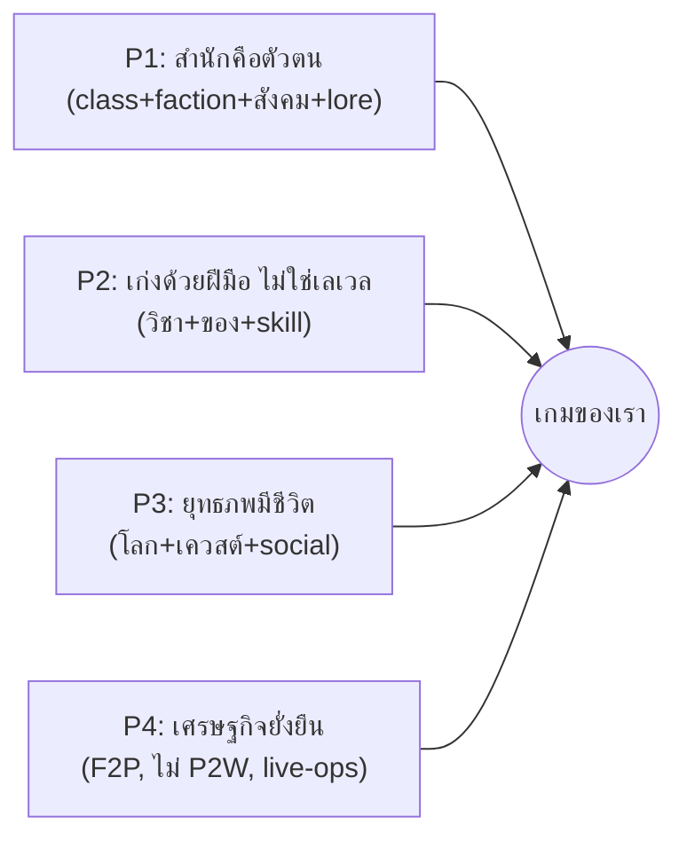
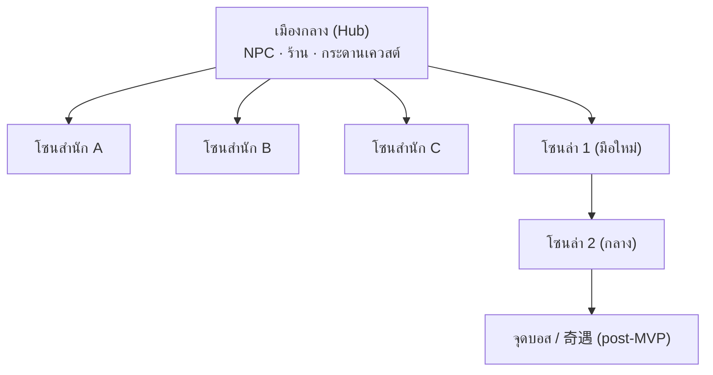
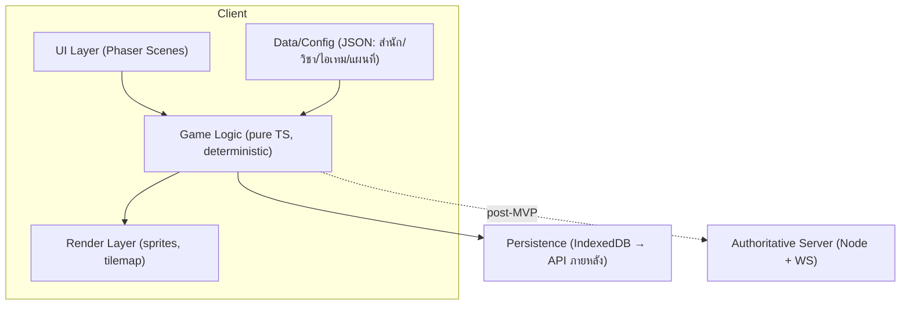
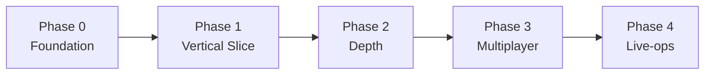

# วิถีพยัคฆ์ — Game Design Document (v0.1 / Foundation)

> [!info] เอกสารนี้คืออะไร
> GDD ฉบับแรกของ **เกมเราเอง** — MMO กำลังภายใน 2D isometric บนเว็บ
> แปลงข้อมูลอ้างอิงจาก [[jy-online-gdd-reference]] (งานวิจัย JY Online) มาเป็น "ดีไซน์ที่ตัดสินใจแล้ว"
> เป้าหมายของ v0.1: **วางรากฐานที่ขยายต่อได้** + กำหนด **vertical slice แรก** ให้ทีมเล็กทำได้จริง

> [!warning] เรื่องลิขสิทธิ์ — ออกแบบโลกของเราเอง
> เกมนี้ **ไม่ใช้ IP กิมย้ง / ชื่อนิยาย / ชื่อสำนักจริง** เราหยิบเฉพาะ *กลไกการออกแบบ* และ *อารมณ์ยุทธภพ*
> ชื่อโลก สำนัก ตัวละครตำนาน และวิชาทั้งหมด เป็นของเราเอง (ดูภาคผนวก A — naming)

---

## สารบัญ
1. [Vision & Positioning](#1-vision--positioning)
2. [Design Pillars](#2-design-pillars)
3. [เสาหลัก 1 — Combat & วิชา](#3-เสาหลัก-1--combat--วิชา)
4. [เสาหลัก 2 — ระบบสำนัก (Sect)](#4-เสาหลัก-2--ระบบสำนัก-sect)
5. [เสาหลัก 3 — โลก & การเดิน/เควสต์](#5-เสาหลัก-3--โลก--การเดินเควสต์)
6. [เสาหลัก 4 — เศรษฐกิจ & Progression](#6-เสาหลัก-4--เศรษฐกิจ--progression)
7. [ส่วนเทคนิค & Data Model](#7-ส่วนเทคนิค--data-model)
8. [Roadmap เป็นเฟส](#8-roadmap-เป็นเฟส)
9. [ความเสี่ยง & สิ่งที่ต้องตัดสินใจต่อ](#9-ความเสี่ยง--สิ่งที่ต้องตัดสินใจต่อ)
10. [ขั้นต่อไป (actionable)](#10-ขั้นต่อไป-actionable)
- [ภาคผนวก A — Naming เกมของเรา](#ภาคผนวก-a--naming-เกมของเรา)

---

## 1. Vision & Positioning

> **"ก้าวเข้าสู่ยุทธภพ เลือกสำนัก ฝึกวิชา และเขียนตำนานของตัวเองในโลกที่เปิดเล่นได้จากเบราว์เซอร์"**

- **Genre:** MMORPG กำลังภายใน (Wuxia) 2D isometric, เล่นบนเว็บ (ไม่ต้องติดตั้ง)
- **Fantasy หลัก:** ผู้เล่นคือจอมยุทธ์ที่ค่อยๆ เก่งขึ้น "จากฝีมือและตัวตน" ไม่ใช่จากแถบเลเวล
- **Hook (เหตุผลที่คนเลือกเล่นเรา):**
  1. **สำนัก = ตัวตน** — เลือกสำนักแล้วได้ทั้งวิชา สังคม และจุดยืนทางคุณธรรมในเรื่องเดียว
  2. **ไม่มีเลเวลตัวละคร** — ความเก่งวัดจากวิชา + อุปกรณ์ + ฝีมือจริง (skill ceiling สูง)
  3. **เล่นจากเบราว์เซอร์ทันที** — ลดแรงเสียดทานการเข้าเล่นเทียบ MMO ติดตั้งหนัก
- **กลุ่มเป้าหมาย:** แฟนเกมกำลังภายใน/wuxia, ผู้เล่น MMO สาย social/PvP, ผู้เล่น casual ที่อยากได้เกมเปิดเล่นเร็ว

> [!tip] บทเรียนที่ยึดจาก reference (สรุป)
> JY Online อยู่ได้ 20+ ปีเพราะ **ดีไซน์ + content + community + live-ops** ไม่ใช่กราฟิก
> และ "ตาย" ในไทยเพราะการบริหารจัดการ → เราออกแบบโดยถือว่า **live-ops/เศรษฐกิจคือเรื่องเป็นเรื่องตาย**

### สิ่งที่ตั้งใจ "ตัด/ปรับ" จาก JY Online ตั้งแต่ต้น
| ของเดิมใน JY Online | การตัดสินใจของเรา | เหตุผล |
|---|---|---|
| เงื่อนไขปลดวิชา "ออนไลน์ 3,000–5,200 ชม." | **ตัดทิ้ง** ใช้เงื่อนไขเชิงความสำเร็จแทน (เควสต์/ฝีมือ/สะสม in-game) | กดดัน casual + ส่งเสริม bot/macro |
| ขายวิชาแรงใน cash shop (P2W) | **ตัด** ขายเฉพาะ cosmetic + convenience | ยั่งยืนกว่า, ชุมชนไม่แตก |
| เปลี่ยน core combat กลางคัน (เทิร์น→เรียลไทม์) | **เลือกระบบเดียวตั้งแต่ต้น** (ดู §3) | เปลี่ยน core = ความเสี่ยงสูงสุด |
| 14 สำนัก + วิชานับร้อยตั้งแต่เปิด | **เริ่ม 3 สำนักใน slice แรก** ขยายเป็นชุด | scope จริงของทีมเล็ก |
| ฝึกวิชา 24 ชม. / grind หนัก | **QoL ตั้งแต่แรก** (auto-rest, ฝึกแบบ session สั้น) | รองรับผู้เล่นยุคใหม่ |

---

## 2. Design Pillars

ทุกการตัดสินใจดีไซน์ต้องผ่าน 4 เสานี้:



1. **สำนักคือตัวตน** — ระบบสังกัดเป็นแกนกลาง รวม class + faction + สังคม + lore
2. **เก่งด้วยฝีมือ ไม่ใช่เลเวล** — progression ผูกกับวิชา/อุปกรณ์/ความชำนาญ
3. **ยุทธภพมีชีวิต** — โลกที่มีสถานที่ในตำนาน เควสต์อิงเนื้อเรื่อง และปฏิสัมพันธ์ผู้เล่น
4. **เศรษฐกิจยั่งยืน** — F2P ที่ไม่ P2W, sink/source ชัด, ออกแบบกัน RMT/บอทตั้งแต่ต้น

---

## 3. เสาหลัก 1 — Combat & วิชา

### 3.1 การตัดสินใจหลัก: ระบบต่อสู้แบบ "เรียลไทม์เชิงยุทธวิธี (Tactical Real-time)"

> [!important] เลือก **เรียลไทม์ + ยุทธวิธี** (ไม่ใช่เทิร์นเบส, ไม่ใช่ action ไล่ฟันมั่ว)
> เคลื่อนที่/เล็งแบบเรียลไทม์ + สกิลมี cooldown + การวางตำแหน่ง/จังหวะ/คอมโบมีผลจริง

**เหตุผล:**
- ตรงกับ "feel" ที่ผู้เล่น JY Online ชื่นชม (เรียลไทม์ + วางหมาก, hit-stun, คอมโบ) — `[อิงรีวิวจาก reference]`
- ให้ **skill expression** สอดคล้อง Pillar 2 (เก่งด้วยฝีมือ)
- ทำบนเว็บ/Phaser ได้จริง และยังเป็น **deterministic-friendly** พอสำหรับ networking ภายหลัง
- หลีกเลี่ยงกับดักของ JY (เปลี่ยน core กลางคัน) — เราเลือกอันเดียวแล้วยึด

**กติกาแกนของ combat:**
- ตัวละครมี **HP (氣血) + Stamina/ลมปราณ (內力)** — สกิลภายในกิน 內力, การวิ่ง/หลบกิน stamina
- ทุกการโจมตีมี **น้ำหนักการกระทบ (hit-stun/stagger)** ต่างกันตามชนิดอาวุธ-สกิล → "ฟีลหนักแน่น"
- **คอมโบ:** สกิลบางตัวต่อเนื่องกันได้ถ้ากดในจังหวะ (timing window) → ให้รางวัลฝีมือ
- **การวางตำแหน่ง:** สกิล AoE/ทิศทาง ทำให้การเดินหลบ/เข้าทำมีความหมาย
- ไม่มี auto-combat บังคับ แต่มี **assist mode (QoL)** สำหรับ grind เบาๆ (เปิด/ปิดได้)

### 3.2 วิชา 3 ประเภท (ยึดจาก reference, ปรับให้คม)
| ประเภท | บทบาท | ตัวอย่างกลไก |
|---|---|---|
| **วิชาฝีมือ/อาวุธ (外功)** | ดาเมจหลัก, ผูกกับอาวุธ | หมัด, กระบี่, ดาบ — แต่ละชนิดมี moveset |
| **วิชาภายใน (內功)** | บัฟ/ทรัพยากร/สถานะ | เพิ่ม 內力 สูงสุด, ฟื้นฟู, ลดดาเมจ, ปลดล็อกพลังพิเศษ |
| **วิชาตัวเบา (輕功)** | เคลื่อนที่/หลบ | พุ่ง (dash), เพิ่มความเร็ว, หลบสุ่ม, เข้าถึงพื้นที่ลับ |

**กฎจับคู่อาวุธ-วิชา (ยึดจาก reference):** วิชาหมัด→มือเปล่า/กรงเล็บ, วิชากระบี่→กระบี่, วิชาดาบ→ดาบ
→ การเปลี่ยนอาวุธ = เปลี่ยน playstyle จริง (ไม่ใช่แค่ตัวเลข)

### 3.3 Progression ที่ไม่ผูกกับเลเวลตัวละคร

> [!important] **ไม่มีเลเวลตัวละคร** — power = ระดับวิชา + อุปกรณ์ + ประสบการณ์รบจริง
> ยึดจุดเด่นที่สุดของ JY Online ไว้ เป็นตัวสร้างเอกลักษณ์

- **แต้มเรียนวิชา (Skill Points)** — ได้จากล่ามอนสเตอร์/เควสต์ ใช้ยกระดับวิชา
- **ประสบการณ์รบ (Combat XP)** — สะสมจากการสู้จริง เป็น gate ของวิชาขั้นสูง
- **ระดับวิชา (Skill Rank)** — แต่ละวิชาไต่ rank ของตัวเอง (เช่น 1→10) เพิ่มพลัง/ปลด moveset
- **Hidden stats (ขยายภายหลัง):** ปัญญา/วาสนา/พรสวรรค์ ฯลฯ เป็นเงื่อนไขปลดวิชาตำนาน (post-MVP)

### 3.4 Chase items ปลายเกม (post-MVP, ออกแบบ hook ไว้ตั้งแต่ตอนนี้)
- **วิชาชั้นสูงนอกสำนัก** — หาได้นอกระบบ class ปกติ, เป็น long-term goal
- ช่องทางได้มาแบบ **奇遇 (เหตุการณ์สุ่มบังเอิญ)** → สร้างตำนานปากต่อปาก/community
- **gating หลายชั้น** ด้วย achievement in-game (ไม่ใช่ชั่วโมงออนไลน์)

### 3.5 ขอบเขต Combat — MVP vs ขยายต่อ
| อยู่ใน slice แรก (MVP) | กันไว้ขยายภายหลัง |
|---|---|
| เรียลไทม์เชิงยุทธวิธี 1 ชุดกติกา | คอมโบขั้นสูง / cancel ขั้นสูง |
| วิชา 3 ประเภท, อาวุธ 2-3 ชนิด | วิชาตำนานนอกสำนัก + hidden stats |
| 8-12 วิชาต่อสำนัก × 3 สำนัก | ระบบแกนใน 5 ธาตุ / เซียนเปลี่ยน |
| hit-stun พื้นฐาน, cooldown, 內力 | PvP combat balancing เชิงลึก |

> [!tip] 💡 Takeaway เสาหลัก 1
> ✅ เรียลไทม์+ยุทธวิธี, ไม่มีเลเวล, วิชา 3 ประเภทผูกอาวุธ — ตัดสินใจชัดและยึดยาว
> ⚠️ ต้องคุม scope จำนวนวิชาใน MVP ให้ balance ได้จริง

---

## 4. เสาหลัก 2 — ระบบสำนัก (Sect)

### 4.1 สำนัก = class + faction + สังคม + lore (แกนกลางของเกม)
ยึดจุดขายหลักของ reference: สำนักไม่ใช่แค่ class แต่เป็นตัวตนของผู้เล่น

**แต่ละสำนักประกอบด้วย:**
- **วิชาเด่น/สไตล์การเล่น** (combat identity)
- **ค่าคุณธรรม/identity เฉพาะตัว** (เช่น ใจสงบ / เมตตา / ปราบความชั่ว) — gate การเรียนวิชาบางส่วน
- **Art direction** (เครื่องแต่งกาย, สถาปัตยกรรมสำนัก, สี)
- **จุดยืนในโลก** (พันธมิตร/ศัตรูตามธรรมชาติ → เชื้อเพลิง PvP/เนื้อเรื่อง)

### 4.2 สามสำนักตัวอย่าง (slice แรก) — ของเราเอง
> ออกแบบให้ครอบ archetype สามขั้ว: บุก / ตั้งรับ-สนับสนุน / คล่องแคล่ว-ลอบ

| สำนัก (working name) | Archetype | วิชาเด่น | ค่า identity | Art direction |
|---|---|---|---|---|
| **สำนักศิลาวัชระ (Vajra Cliff)** | บุก/ทนทาน (หมัด) | หมัดกระแทก AoE, เกราะลมปราณ | **ค่าวิริยะ (Resolve)** — ได้จากการยืนหยัดในศึก | ผ้าคลุมหินเทา, วัดภูเขา, โทนน้ำตาล-ทอง |
| **สำนักธารเมตตา (Mercy Stream)** | สนับสนุน/รักษา | ฝ่ามือฟื้นฟู, บัฟกลุ่ม, ลดสถานะร้าย | **ค่าเมตตา (Compassion)** — ได้จากช่วยผู้เล่น/ช่วยเหลือ NPC | ชุดขาว-ฟ้า, ศาลาน้ำ, โทนสว่างเย็น |
| **สำนักเงาพระจันทร์ (Moonshade)** | คล่อง/ลอบโจมตี (กระบี่) | กระบี่เร็ว, dash, พิษ/หลบสุ่มสูง | **ค่าใจสงบ (Serenity)** — ได้จากภารกิจเดี่ยว/ความแม่นยำ | ชุดดำ-เงิน, สุสาน/ป่าไผ่กลางคืน |

> [!note] ทำไม "ค่า identity ผูกกับการฝึกวิชา" (ยึดจาก reference)
> progression ผูกกับ **บทบาท/จริยธรรม** ของสำนัก ไม่ใช่แค่ฟาร์ม XP
> เช่น Mercy Stream ต้องสะสม "ค่าเมตตา" (ช่วยคนอื่นจริงในเกม) จึงเรียนวิชาขั้นสูงได้ → พฤติกรรมตรงกับ lore

### 4.3 กลไกสำนัก (MVP)
- **เข้าสำนัก:** เลือกได้หลังเควสต์มือใหม่ (บางสำนักมีเงื่อนไข — ขยายภายหลัง)
- **เรียนวิชา:** จากอาจารย์สำนัก (NPC) ใช้ Skill Points + ค่า identity
- **ความเป็นศิษย์:** ฝึกวิชาถึง rank สูงสุด → เป็นศิษย์ถาวร → ปลดวิชาแก่นแท้ (post-MVP: daily loop)
- **เปลี่ยนสำนัก:** มี NPC ช่วย (มี cost) — กันการสลับพร่ำเพรื่อ

### 4.4 ขอบเขต Sect — MVP vs ขยายต่อ
| MVP | ขยายภายหลัง |
|---|---|
| 3 สำนัก, เข้า/เรียนวิชา/ค่า identity | เพิ่มเป็น 8-14 สำนัก เป็นชุด (content patch) |
| อาจารย์สำนัก + วิชาสำนัก | ตั้งสำนักเอง / คิดวิชาเอง (sandbox) |
| ความสัมพันธ์สำนักแบบ lore (static) | สงครามสำนัก / ระบบประลอง 2 สาย |

> [!tip] 💡 Takeaway เสาหลัก 2
> ✅ 3 สำนักครอบ 3 archetype + ค่า identity ที่ผูกพฤติกรรมกับ lore
> ✅ ออกแบบ data ของสำนักให้ "เพิ่มสำนักใหม่ = เพิ่ม config" ไม่ใช่แก้โค้ด (ดู §7)

---

## 5. เสาหลัก 3 — โลก & การเดิน/เควสต์

### 5.1 โครงสร้างโลก 2D isometric
- **มุมมอง:** 2D isometric (เฉียงกดลง) — ยึดจาก reference, เหมาะกับเว็บ/Phaser
- **โครงแผนที่:** โลกแบ่งเป็น **โซน (zone)** เชื่อมกันด้วยทางออก (portal/edge)
  - **เมืองกลาง (hub)** — NPC, ร้านค้า, กระดานเควสต์, จุดเดินทาง
  - **โซนสำนัก** — ที่ตั้งของแต่ละสำนัก (อาจารย์, ลานฝึก)
  - **โซนล่า (field)** — มอนสเตอร์, ทรัพยากร, จุด 奇遇 (ขยายภายหลัง)
- **ระบบเดิน:** คลิกเพื่อเดิน (point-to-click) + pathfinding บน tile grid; วิชาตัวเบาเพิ่มความเร็ว/ลัด
- **บรรยากาศ (ยึดจาก reference):** ระบบสภาพอากาศ (เช่น ฝน) เป็น polish เพิ่ม immersion (post-MVP)



### 5.2 NPC & เควสต์
- **ประเภทเควสต์ (ยึดจาก reference):**
  - **เควสต์เมือง** — ทำความรู้จักโลก, สอนระบบ (onboarding)
  - **เควสต์สำนัก** — ผูกกับ identity/วิชาของสำนัก, ปลด progression
  - **เควสต์ยุทธภพ** — เนื้อเรื่องหลักของโลกเรา (เครือข่ายตัวละครตำนานของเราเอง)
- **เส้นทางมือใหม่ (onboarding):** เข้าเกม → เรียนพื้นฐาน (NPC) → ล่ามอนแรก → เลือกสำนัก → เรียนวิชาเด่น
  - ยึดบทเรียน reference: onboarding ละเอียด = retention

### 5.3 ขอบเขต World — MVP vs ขยายต่อ
| MVP | ขยายภายหลัง |
|---|---|
| 1 เมือง hub + 3 โซนสำนัก + 2 โซนล่า | แผนที่ "สถานที่ในตำนาน" จำนวนมาก |
| point-to-click + pathfinding | พาหนะ (ม้า/เรือ), เดินเรือ |
| เควสต์เมือง/สำนัก/ยุทธภพ (สายสั้น) | เควสต์เชน NPC ดัง, 奇遇 สุ่ม |
| NPC ร้าน/อาจารย์/เควสต์ | สภาพอากาศ, sandbox (บ้าน/แต่งงาน) |

> [!tip] 💡 Takeaway เสาหลัก 3
> ✅ โครงโซนแบบ hub-and-spoke → เพิ่มโซน/สำนักใหม่ได้โดยไม่กระทบของเดิม
> ✅ เควสต์ 3 ประเภทผูกกับ onboarding และ identity สำนัก

---

## 6. เสาหลัก 4 — เศรษฐกิจ & Progression

### 6.1 โมเดลรายได้: F2P ไม่ P2W (ตัดสินใจตั้งแต่ต้น)
> [!important] เริ่มที่ **F2P + cosmetic/convenience** เลย — เลี่ยงประวัติศาสตร์ P2W ของ reference
> ขายความสะดวก/ความสวย ไม่ขายพลัง: ของในร้านต้องหาเทียบเท่าได้ในเกม (บทเรียน 至尊版)

- **ขายได้:** cosmetic (สกิน/ชุด/บ้าน), convenience (ช่องเก็บของ, ฝึกเร็วขึ้นเล็กน้อย, VIP QoL)
- **ห้ามขาย:** วิชาแรง, ค่าพลังตรงๆ, ของที่กระทบ balance PvP

### 6.2 สกุลเงิน & Sink/Source
| | รายการ |
|---|---|
| **สกุลเงิน** | เงินในเกม (soft) + เหรียญพรีเมียม (hard, เฉพาะ cosmetic/convenience) |
| **Source** | ทำงาน/อาชีพ, ดรอปมอนสเตอร์, ฟาร์มอุปกรณ์ขายตลาด, รางวัลเควสต์ |
| **Sink** | ค่าเรียนวิชา, ซ่อม/อัปเกรดอุปกรณ์, ค่าเปลี่ยนสำนัก, บ้าน/ตกแต่ง (post-MVP) |

> [!important] ออกแบบ sink/source ให้สมดุลตั้งแต่ต้น (บทเรียนเงินเฟ้อ/บอท)
> ทุก source ต้องมี sink รองรับ; ของที่ฟาร์มได้ไม่จำกัดต้องมีทางถูกดูดออกจากระบบ

### 6.3 กัน RMT / บอท ตั้งแต่ออกแบบ
- คาดการณ์ตลาดซื้อขายนอกเกม (RMT) ตั้งแต่แรก (บทเรียน reference)
- มาตรการ: ระบบ trade ในเกมที่ track ได้, sink ที่ดูดเงินส่วนเกิน, rate-limit การฟาร์ม, ตรวจจับ pattern บอท, ผูกบัญชี
- assist mode ทำให้ "ไม่ต้องใช้บอท" → ลดแรงจูงใจสร้างบอท

### 6.4 ขอบเขต Economy — MVP vs ขยายต่อ
| MVP | ขยายภายหลัง |
|---|---|
| 1 สกุลเงิน soft + sink/source พื้นฐาน | เหรียญพรีเมียม + cash shop |
| ดรอป/รางวัลเควสต์, ร้าน NPC | ตลาดผู้เล่น (auction), อาชีพ/crafting |
| ค่าเรียนวิชา/ซ่อมเป็น sink | บ้าน/อสังหา, แต่งงาน (sandbox sink) |

> [!tip] 💡 Takeaway เสาหลัก 4
> ✅ F2P ไม่ P2W เป็นกฎเหล็ก, sink/source วางล่วงหน้า, กัน RMT/บอทตั้งแต่ดีไซน์
> ⚠️ เศรษฐกิจ + live-ops คือปัจจัยอยู่รอด — ต้องมีคนดูแลตัวเลขต่อเนื่อง

---

## 7. ส่วนเทคนิค & Data Model

### 7.1 Tech stack
- **Client:** TypeScript + **Phaser 3** (2D, รองรับ isometric tilemap, WebGL/Canvas)
- **Build:** Vite (dev เร็ว, bundle เล็ก)
- **State/logic:** แยก **game logic (pure TS)** ออกจาก rendering (Phaser) → test ได้ + reuse ฝั่ง server ภายหลัง
- **Persistence (MVP):** local (IndexedDB/localStorage) — เล่น single-player/offline ก่อน
- **Server (post-MVP):** Node.js + WebSocket, authoritative server; ออกแบบ logic ให้ย้ายไปรันฝั่ง server ได้

### 7.2 สถาปัตยกรรม (เริ่ม single-player → ขยายเป็น MMO)


> [!important] หลักการที่ทำให้ "ขยายต่อได้"
> 1. **Logic แยกจาก render** — combat/economy เป็น pure functions, ทดสอบได้, ย้ายขึ้น server ได้
> 2. **Data-driven** — สำนัก/วิชา/ไอเทม/แผนที่ เป็น **config (JSON)** ไม่ hardcode → เพิ่มเนื้อหา = เพิ่มไฟล์ data (รองรับ content patch แบบ reference)
> 3. **ECS-lite** — entity (player/mob/npc) ประกอบจาก component → เพิ่มพฤติกรรมใหม่ได้ยืดหยุ่น

### 7.3 Data Model หลัก (ร่าง)
```ts
// ---------- Sect ----------
interface SectDef {
  id: string;                 // "vajra_cliff"
  name: string;               // "สำนักศิลาวัชระ"
  archetype: "bruiser" | "support" | "skirmisher";
  identityStat: IdentityStatDef;   // ค่าคุณธรรมเฉพาะสำนัก
  weaponTypes: WeaponType[];       // อาวุธที่ใช้ได้
  skillIds: string[];              // วิชาของสำนัก (อ้างถึง SkillDef)
  art: { palette: string; outfit: string; architecture: string };
}

interface IdentityStatDef {
  id: string;                 // "resolve" | "compassion" | "serenity"
  name: string;               // "ค่าวิริยะ"
  gainFrom: string[];         // เงื่อนไขได้ค่า (เช่น "heal_ally", "kill_bandit")
}

// ---------- Skill ----------
interface SkillDef {
  id: string;
  name: string;
  type: "external" | "internal" | "movement";   // 外功/內功/輕功
  weaponType?: WeaponType;     // ต้องคู่กับอาวุธ (สำหรับ external)
  maxRank: number;
  ranks: SkillRank[];          // ค่าพลังต่อ rank
  requirements: SkillRequirement;  // skillPoints, combatXP, identityStat, prereqSkillIds
  hitStun: number;             // น้ำหนักการกระทบ
  cooldownMs: number;
  staminaCost: number;         // 內力
}

// ---------- Character ----------
interface Character {
  id: string;
  sectId: string | null;
  // ไม่มี level! power มาจากด้านล่าง:
  skills: Record<string, { rank: number }>;
  skillPoints: number;
  combatXP: number;
  identityStats: Record<string, number>;   // resolve/compassion/...
  equipment: EquipmentSlots;
  hp: number; stamina: number;             // 氣血 / 內力
  inventory: ItemStack[];
  currency: { soft: number; premium: number };
}

// ---------- World ----------
interface ZoneDef {
  id: string;
  name: string;
  type: "hub" | "sect" | "field";
  tilemapRef: string;          // ไฟล์ tilemap (Tiled JSON)
  exits: { toZoneId: string; at: TilePos }[];
  npcs: NpcSpawn[];
  spawns?: MobSpawn[];         // field zones
}

interface QuestDef {
  id: string;
  category: "city" | "sect" | "jianghu";
  steps: QuestStep[];
  rewards: { skillPoints?: number; soft?: number; itemIds?: string[] };
  requirements?: { sectId?: string; prereqQuestIds?: string[] };
}
```

> [!note] ทำไม model นี้รองรับการขยาย
> - เพิ่มสำนักใหม่ = เพิ่ม `SectDef` + วิชา (JSON) ไม่แตะโค้ด combat
> - `Character` ไม่มี `level` → ยึด Pillar 2 ตั้งแต่ schema
> - `ZoneDef.exits` = ต่อโซนใหม่เข้ากับโลกเดิมได้อิสระ (hub-and-spoke)
> - แยก `*Def` (config) ออกจาก instance (runtime state) ชัดเจน

### 7.4 โครงไฟล์/โมดูลที่แนะนำ
```
src/
  core/            # pure TS game logic (ทดสอบได้, ไม่พึ่ง Phaser)
    combat/        # resolve hits, cooldown, hit-stun, combo
    skills/        # ระบบเรียน/ไต่ rank วิชา
    sect/          # logic สำนัก + identity stats
    economy/       # sink/source, currency, trade rules
    progression/   # skill points, combat XP, requirements
  data/            # config JSON (สิ่งที่ designer แก้ได้)
    sects/*.json
    skills/*.json
    items/*.json
    zones/*.json
    quests/*.json
  render/          # Phaser scenes, sprites, tilemap, UI
    scenes/
    entities/      # render ของ player/mob/npc (ECS-lite view)
  state/           # persistence (IndexedDB), save/load
  net/             # (post-MVP) WebSocket client, sync
  main.ts
tests/             # unit tests ของ core/
```

> [!tip] กฎเหล็ก: `render/` และ `net/` พึ่ง `core/` ได้ แต่ `core/` **ห้าม** พึ่ง Phaser/DOM
> → ย้าย `core/` ขึ้น authoritative server ได้ทันทีตอนทำ MMO

---

## 8. Roadmap เป็นเฟส



### Phase 0 — Foundation (รากฐาน)
- ตั้งโปรเจกต์ (Vite + TS + Phaser), โครงไฟล์ตาม §7.4
- วาง data schema + loader (อ่าน JSON config)
- render tilemap isometric + เดินตัวละคร (point-to-click + pathfinding)
- **เกณฑ์ผ่าน:** เดินตัวละครในโซนเดียวบนแผนที่ isometric ได้

### Phase 1 — Vertical Slice (สิ่งที่ user ขอเป็น slice แรก)
ครอบ **ทั้ง 4 เสาหลักในระดับ MVP**:
- **Combat:** เรียลไทม์เชิงยุทธวิธี, วิชา 3 ประเภท, hit-stun/cooldown/內力, อาวุธ 2-3 ชนิด
- **Sect:** 3 สำนัก, เข้าสำนัก, เรียนวิชาจากอาจารย์, ค่า identity พื้นฐาน
- **World:** 1 hub + 3 โซนสำนัก + 2 โซนล่า, NPC, เควสต์ 3 ประเภท (สายสั้น), onboarding
- **Economy/Progression:** soft currency, sink/source พื้นฐาน, skill points + combat XP, ร้าน NPC
- persistence แบบ local (เล่นจบลูปได้คนเดียว)
- **เกณฑ์ผ่าน:** ผู้เล่นใหม่ → ทำเควสต์ → เลือกสำนัก → เรียนวิชา → ล่ามอน → ใช้เงินเรียนวิชาเพิ่ม ครบ 1 ลูป

### Phase 2 — Depth (เพิ่มความลึก, ยังคนเดียว/co-op เล็ก)
- วิชาตำนานนอกสำนัก + hidden stats + 奇遇 สุ่ม
- เพิ่มสำนัก (เป้าหมาย 6-8), ระบบประลอง, แกนใน 5 ธาตุ
- สภาพอากาศ, พาหนะ, อาชีพ/crafting

### Phase 3 — Multiplayer
- ย้าย `core/` ขึ้น authoritative server (Node + WS)
- sync ผู้เล่นหลายคนในโซน, chat, trade
- PvP/สงครามสำนักพื้นฐาน

### Phase 4 — Live-ops
- content patch เป็นชุดมีธีม (cadence สม่ำเสมอ — บทเรียน reference)
- cash shop (cosmetic/convenience), VIP/daily login
- เครื่องมือ monitor เศรษฐกิจ/บอท, community/สอนมือใหม่

---

## 9. ความเสี่ยง & สิ่งที่ต้องตัดสินใจต่อ

| ความเสี่ยง | ผลกระทบ | แนวทาง |
|---|---|---|
| **Scope creep** (MMO ใหญ่เกินทีม) | ทำไม่เสร็จ | ยึด Phase 1 เป็น vertical slice, อย่าแตะ Phase 3+ ก่อนผ่าน |
| **Combat balancing** ข้ามสำนัก | meta พัง, PvP ไม่สนุก | เริ่ม 3 สำนักครอบ 3 archetype, ทำ logic ให้ test/tune ง่าย |
| **เศรษฐกิจเฟ้อ/บอท** | เศรษฐกิจพัง (บทเรียน rej.) | sink/source ล่วงหน้า, assist mode ลดแรงจูงใจบอท |
| **Networking ตอนทำ MMO** | rework ใหญ่ | แยก `core/` deterministic ตั้งแต่ Phase 0 |
| **ลิขสิทธิ์ IP** | กฎหมาย | ใช้ชื่อ/โลกของเราเองทั้งหมด (ภาคผนวก A) |

**สิ่งที่ต้องตัดสินใจต่อ (open questions):**
1. **Art pipeline** — วาดเอง / asset pack / AI-assisted? (กระทบ timeline Phase 1)
2. **ชื่อเกมจริง** + ธีมโลก (ตอนนี้เป็น working title)
3. **เป้าหมายตลาด** — ไทยเป็นหลัก หรือ global (i18n ตั้งแต่ต้น?)
4. **ขนาดทีม & timeline** — กำหนด velocity เพื่อตัด scope Phase 1 ให้พอดี
5. **PvP-first หรือ PvE-first** — กระทบลำดับ Phase 2-3

---

## 10. ขั้นต่อไป (actionable)

1. **ยืนยัน working title + ธีมโลกของเราเอง** (หรือ greenlight ภาคผนวก A ไปก่อน)
2. **ตั้งโปรเจกต์ Phase 0** — Vite + TS + Phaser, โครงไฟล์ตาม §7.4, data loader
3. **เขียน data schema เป็น TypeScript types + ตัวอย่าง JSON** ของ 3 สำนัก/วิชา (ทำให้ §7.3 รันได้จริง)
4. **Prototype การเดิน isometric** ในโซนเดียว (เกณฑ์ผ่าน Phase 0)
5. **ตัดสินใจ art pipeline** เพื่อ unblock การทำ slice จริง

> ถ้าพร้อม ผมเริ่ม **ขั้นที่ 2-3 (ตั้งโปรเจกต์ + เขียน schema/JSON ตัวอย่าง)** ให้เป็นโค้ดจริงได้ทันที

---

## ภาคผนวก A — Naming เกมของเรา

> ชื่อทั้งหมดเป็น **ของเราเอง** (ไม่อิง IP จริง) — เป็น placeholder ที่ปรับได้

- **Working title:** *วิถีพยัคฆ์ (Tiger's Way)* / *Jianghu Online*
- **3 สำนัก slice แรก:** สำนักศิลาวัชระ (Vajra Cliff) · สำนักธารเมตตา (Mercy Stream) · สำนักเงาพระจันทร์ (Moonshade)
- **ค่า identity:** วิริยะ (Resolve) · เมตตา (Compassion) · ใจสงบ (Serenity)
- **สกุลเงิน:** เบี้ยยุทธภพ (soft) · หยกสวรรค์ (premium)
- โทนโลก: ยุทธภพสมมติ "แผ่นดินเก้ามณฑล" — ไม่อิงประวัติศาสตร์/นิยายจริง
