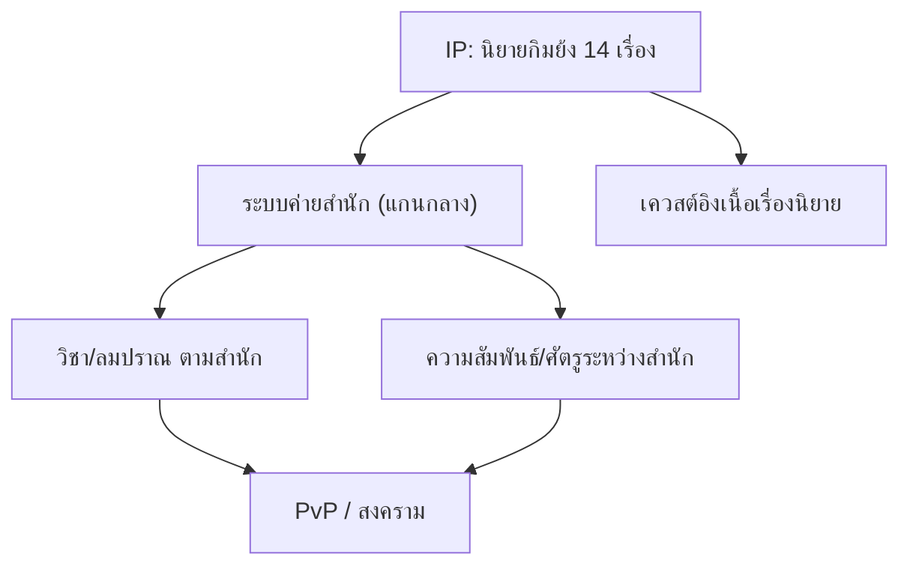

---
aliases:
  - JY Online GDD Reference
  - มังกรหยกออนไลน์ ข้อมูลอ้างอิงออกแบบเกม
  - Jin Yong Online Reference
tags:
  - game-design/jy-online
  - mmorpg
  - wuxia
  - reference
created: 2026-06-20
updated: 2026-06-20
machine: claude-code-web
---

# JY Online (มังกรหยกออนไลน์) — GDD Reference

> [!info] เอกสารนี้คืออะไร
> ข้อมูลอ้างอิงเกม **JY Online / มังกรหยกออนไลน์ (金庸群俠傳 Online)** เพื่อใช้ตั้งต้น
> ออกแบบเกม MMORPG กำลังภายในสไตล์เดียวกัน — สร้างจาก prompt [[collect-jy-online-gdd-reference]]
> เน้น 3 ด้าน: Gameplay & ระบบหลัก · เศรษฐกิจ & Monetization · Art & World

> [!note] ระดับความน่าเชื่อถือของข้อมูล
> WebFetch/curl เข้าถึงหน้าเว็บตรง ๆ ไม่ได้ (403 / network egress allowlist) ข้อมูลทั้งหมดจึงดึงผ่าน
> **WebSearch** (สรุปเนื้อหาจากแหล่งจีน/ไต้หวัน/ไทยจำนวนมาก) เสริมด้วยความรู้ genre — ทำเครื่องหมายกำกับทุกประเด็น:
> - `[ยืนยันได้]` = พบจากแหล่งอ้างอิงโดยตรง (ตอนนี้ครอบคลุมเกือบทั้งรายงาน)
> - `[อิงรีวิว]` = สรุปจากคำบรรยาย/รีวิวผู้เล่น (เช่น feel การต่อสู้ ที่ไม่ได้ดูคลิปเอง)
> - `[อนุมาน]` = สรุปจากบริบท genre/ยุคสมัย ยังไม่ยืนยันรายละเอียด
> - `[ไม่พบข้อมูล]` = ต้องหาเพิ่มก่อนนำไปใช้จริง (เหลือเฉพาะค่าตัวเลข balance เชิงลึก)

---

## ภาพรวมเกม

| หัวข้อ | ข้อมูล | ระดับ |
|--------|--------|-------|
| ชื่อ | JY Online / มังกรหยกออนไลน์ / 金庸群俠傳 Online (Jin Yong Online) | `[ยืนยันได้]` |
| ผู้พัฒนา | Chinese Gamer International (ไต้หวัน) | `[ยืนยันได้]` |
| ผู้ให้บริการในไทย | Asiasoft (เอเชียซอฟท์) | `[ยืนยันได้]` |
| เปิดบริการไทย | พฤศจิกายน พ.ศ. 2546 (2003) | `[ยืนยันได้]` |
| ความนิยมแรกเปิด | ผู้ลงทะเบียน ~100,000 ราย ภายใน 1 สัปดาห์ | `[ยืนยันได้]` |
| อายุการให้บริการ (ไทย) | ~3 ปี 4 เดือน แล้วปิดตัว (ปัญหาการบริหารจัดการเกม) | `[ยืนยันได้]` |
| ประเภท | MMORPG กำลังภายใน (Wuxia) | `[ยืนยันได้]` |
| IP ต้นทาง | นิยายกำลังภายใน **กิมย้ง (Jin Yong) ทั้ง 14 เรื่อง** | `[ยืนยันได้]` |
| ต้นฉบับไต้หวัน | เปิด **5 ก.ค. 2001** ได้รางวัล Best Original Game ปี 2001 | `[ยืนยันได้]` |
| กราฟิก | **2D มุมเฉียง isometric** (半即時制 2D) สไตล์ MMO ต้นยุค 2000, มีระบบสภาพอากาศ (ฝน) | `[ยืนยันได้]` |
| เวอร์ชัน | 收費版 (เสียเงิน) · 免費版 (ฟรี) · 至尊版 (Supreme) · 懷舊版 (Nostalgic) | `[ยืนยันได้]` |

> [!note] จุดขายหลัก (positioning)
> "ท่องยุทธภพในโลกนิยายกิมย้ง" — ดึงแฟนนิยาย/หนังกำลังภายในเป็นฐานผู้เล่น
> โดยมี **ระบบค่ายสำนัก (sect)** เป็นแกนกลางของอัตลักษณ์ตัวละครและความขัดแย้ง

---

## 1. Gameplay & ระบบหลัก

### Core loop
- ล่ามอนสเตอร์เก็บ **แต้มเรียนวิชา (學習點數) + ประสบการณ์รบ (實戰經驗)** → ฝึก/อัปเกรดวิชา → ทำเควสต์ (เมือง/สำนัก/ยุทธภพ) → หาเงินด้วยการทำงาน (做工) → PvP/สงครามสำนัก `[ยืนยันได้]`
- เควสต์แบ่งเป็น **城市任務 (เมือง) · 門派任務 (สำนัก) · 江湖任務 (ยุทธภพ)** ดัดแปลงจากโครงเรื่องนิยายกิมย้ง `[ยืนยันได้]`

### ระบบค่ายสำนัก (門派 / Sect) — จุดเด่นที่สุด
- มี **11 สำนักดั้งเดิม**: เส้าหลิน(少林) · บู๊ตึ๊ง(武當) · ง้อไบ๊(峨嵋) · ฮั้วซาน(華山) · เฮ่งซัว(恆山) · ช้วนจิน(全真) · สุสานโบราณ(古墓) · เลือดมีด(血刀) · แป๊ะสิ่ว(星宿) · เล่งจิ่ว(靈鷲) · พรรคกระยาจก(丐幫) `[ยืนยันได้]`
- **至尊版 (Supreme)** เพิ่มอีก 3 สำนัก: เกาะดอกท้อ(桃花島) · พรรคมาร(明教) · เซียวเอี้ยว(逍遙派) `[ยืนยันได้]`
- บางสำนักมี **เงื่อนไขการเข้า** เช่น เส้าหลินรับเฉพาะตัวละครชาย `[ยืนยันได้]`
- เรียนวิชาได้ทั้งจาก **สำนัก** และ **NPC พิเศษ** (สำนักดาบ 武館 = วิชาพื้นฐาน, อาจารย์ถ่ายทอด 傳功師父 = วิชาสูงขึ้น) `[ยืนยันได้]`
- มี **NPC ย้ายสำนัก (門派傳送員)** ที่กระดานข่าวเมืองหลัก ช่วยเดินทาง/เปลี่ยนสำนักสะดวก `[ยืนยันได้]`

**วิชา/ลมปราณประจำสำนัก (ยืนยันได้):**

| สำนัก | วิชาภายใน (內功) | วิชาเด่น / สไตล์ |
|-------|------------------|------------------|
| พรรคกระยาจก (丐幫) | — | All-rounder — 降龍十八掌, 八卦刀 |
| เส้าหลิน (少林) | — | หมัด/วิชากลุ่ม (AoE) — 少林金剛拳, 鐵骨墨鈴拳 |
| ฮั้วซาน (華山) | — | กระบี่เลิศ — 華山劍法 / 獨孤九劍 / 華岳劍髓 |
| บู๊ตึ๊ง (武當) | — | สายในนุ่มสยบแข็ง — 太極拳 |
| เล่งจิ่ว (靈鷲) | — | ฝ่ามือ — 天山六陽掌 |
| ช้วนจิน (全真) | 先天重陽功 | สายในแท้ดั้งเดิม |
| ง้อไบ๊ (峨嵋) | 峨嵋九陰真經 | อัตรา "ปัดป้อง/สลายแรง" สูงสุด (block สุ่ม) |
| เฮ่งซัว (恆山) | 菩薩印心法 | สายเมตตา เน้นรักษา |
| แป๊ะสิ่ว (星宿) | 神木功 | สายพิษ (万毒蝕骨術) |
| เลือดมีด (血刀) | 佛滅萬劫功 | สายดาบดุดัน |
| สุสานโบราณ (古墓) | 玉女素心經 | 輕功 ดีสุด ฝึกเร็วสุด เพิ่มอัตราหลบสุ่ม |
| เกาะดอกท้อ (桃花島) | — | สำนัก 至尊版 |
| พรรคมาร (明教) | — | สำนัก 至尊版 |
| เซียวเอี้ยว (逍遙派) | — | สำนัก 至尊版 |

> [!important] ระบบ "ค่าคุณธรรม" ผูกกับการฝึกวิชา (จุดออกแบบเด่น) `[ยืนยันได้]`
> แต่ละสำนักมี **ค่าสถานะเชิงคุณธรรมเฉพาะตัว** ที่ต้องสะสมเพื่อปลดล็อก/เพิ่มความชำนาญวิชา:
> - สุสานโบราณ → **ค่าใจสงบ (清心值)**
> - ง้อไบ๊ → **ค่าปราบความชั่ว (斷惡值)** (เพิ่มได้จากเควสต์ล่าโจร 殺盜賊)
> - เฮ่งซัว → **ค่าเมตตา (慈悲值)** (สำนักสายเมตตา ต้องใช้ค่าสูงในการเรียนวิชา)
>
> → progression ผูกกับ "บทบาท/จริยธรรม" ของสำนัก ไม่ใช่แค่ฟาร์มค่า EXP เฉย ๆ

> [!note] รูปแบบการฝึกวิชาสำนัก `[ยืนยันได้]`
> ฝึกวิชาสำนักถึงเลเวล 100 → เป็นศิษย์ถาวร (終身) → ต่อยอดเป็น **วิชาแก่นแท้ (精要武功)**
> รับ "ตำราแก่นแท้ (精要本)" รายวัน ไต่ได้ถึงเลเวล **200** (มี daily loop ในการพัฒนาวิชา)

> [!tip] บทเรียนสำคัญ
> "สำนัก" ในเกมนี้ไม่ใช่แค่ระบบ class แต่เป็น **ทั้ง class + faction + สังคม + lore** ในตัวเดียว
> ทำให้ผู้เล่นผูกพันกับ identity และเกิดความขัดแย้งตามธรรมชาติ (เชื้อเพลิง PvP/สงคราม)

### Combat & การพัฒนาตัวละคร
> [!important] จุดออกแบบที่โดดเด่นที่สุด: **ไม่มีเลเวลตัวละคร (沒有角色等級)**
> ความแข็งแกร่งวัดจาก **ระดับวิชา (武功等級) + ค่าโจมตี/ป้องกันของอุปกรณ์ + ประสบการณ์รบจริง (實戰經驗)**
> ต้องล่ามอนสเตอร์เพื่อสะสมประสบการณ์รบ — ไม่ใช่ไต่เลเวลเก็บ XP แบบ MMO ทั่วไป `[ยืนยันได้]`

- **ระบบต่อสู้เปลี่ยนตามเวอร์ชัน:** v1.0 = **เทิร์นเบส (回合制)**, v1.5 = **เรียลไทม์ (即時制)** `[ยืนยันได้]`
- **วิชาแบ่ง 3 ประเภท:** วิชาฝีมือ/อาวุธ (武功/外功) · วิชาภายใน (內功) · วิชาตัวเบา (輕功) `[ยืนยันได้]`
- **อาวุธต้องเข้าคู่กับวิชา:** วิชาหมัด(拳法)→กรงเล็บ/มือเปล่า, วิชากระบี่(劍法)→กระบี่, วิชาดาบ(刀法)→ดาบ `[ยืนยันได้]`
- **แต้มเรียนวิชา (學習點數)** ได้จากการล่ามอนสเตอร์ ใช้เรียนวิชา สะสมสูงสุด **65,200 แต้ม** `[ยืนยันได้]`
- ค่าสถานะตัวละคร: พื้นฐาน = **精/氣/神/內力** (จิต/ปราณ/วิญญาณ/ลมปราณ), สถานะ = **ความอิ่ม(飽食度)/น้ำ(飲水度)/น้ำหนักแบก(負重)** `[ยืนยันได้]`
- เส้นทางมือใหม่: เรียนรู้หนังสือ(讀書識字)กับ 落第秀才 → ฝึกพื้นฐานกับ NPC → เข้าสำนักเรียนวิชาเด่น `[ยืนยันได้]`
- วิชาผสานจากนิยายทั้ง 14 เรื่อง จูนค่าพลังให้บาลานซ์ `[ยืนยันได้]`

### 🥋 "Feel" การต่อสู้ (จากรีวิว/คำบรรยาย — มือสอง)
> [!warning] ข้อจำกัด: ไม่ได้ดูคลิปโดยตรง
> ผมประมวลผลวิดีโอเองไม่ได้ ส่วนนี้สรุปจาก **คำบรรยาย/รีวิวผู้เล่น (知乎/豆瓣/百度/9game)** จึงเป็น `[อิงรีวิว]`
> รายการคลิปให้ดูเองอยู่ท้ายหัวข้อ

- **มุมมอง:** บุคคลที่สาม มุมกดลง · ต่อสู้แบบเรียลไทม์ + เติมพลัง (即時戰鬥及補給) `[อิงรีวิว]`
- **ลูกผสมที่เป็นเอกลักษณ์:** หลายรีวิวเรียกว่า **"เรียลไทม์ + วางหมาก (即時+戰棋)"** — ไม่ใช่ไล่ฟันมั่ว และไม่ใช่เทิร์นเบสการ์ตูน; ถือว่าแปลกใหม่แม้เทียบยุคนี้ `[อิงรีวิว]`
- **Hit feedback:** โดนอาวุธ/สกิลต่างชนิด มอนสเตอร์มี **อาการชะงัก (僵直/stagger)** ต่างกัน → มีน้ำหนักการกระทบ `[อิงรีวิว]`
- **องค์ประกอบเชิงฝีมือ:** ระบบ **คอมโบ (連招) + การเดินตำแหน่ง/จังหวะ (走位與時機) + การจัดการทรัพยากร** — สกิลบางตัวโดนหลายตัว (AoE) มอนสเตอร์ก็มีสกิลตอบโต้ `[อิงรีวิว]`
- **อารมณ์รวม:** ผู้เล่นชมว่า **"สัมผัสการต่อสู้กำลังภายในดีมาก (武俠戰鬥手感很棒)"** การควบคุมมีเอกลักษณ์ + ลานประลอง (競技台) ที่เซียนมารวมตัว `[อิงรีวิว]`
- **จุดเด่นฝั่งไทย:** กิจกรรม **"ลงทัว" (สงคราม/ตะลุยหมู่)** เป็นที่นิยม → PvP หมู่คือเสน่ห์หลัก `[อิงรีวิว]`

> [!tip] 💡 Takeaway: feel การต่อสู้
> - ✅ ผสาน **เรียลไทม์ + ยุทธวิธี (วางตำแหน่ง/จังหวะ/คอมโบ)** ให้มี skill expression ไม่ใช่ auto
> - ✅ ใส่ **hit-stun/น้ำหนักการกระทบ** ต่างกันตามอาวุธ-สกิล เพื่อให้ "ฟีลหนักแน่น"
> - ✅ ลานประลอง + สงครามหมู่ (ลงทัว) เป็น **content ที่สร้าง feel "ยุทธภพ" และ community**

> [!note] 🎥 คลิปสำหรับดูจับ feel เอง (ผมเปิดดูแทนไม่ได้)
> - YouTube — [JY online มังกรหยกออนไลน์ ทัวร์ จงน้ำ by SPHINX](https://www.youtube.com/watch?v=xwxA75nx9oo) (PvP/ลงทัว)
> - YouTube — [มังกรหยกออนไลน์ JY online](https://www.youtube.com/watch?v=g--rA7t1FOk)
> - Facebook — [JY Online Thailand: ลงทัว คนโหดแบก](https://www.facebook.com/JYOnlineThailand/) (วิดีโอสงครามหมู่)
> - Bilibili — ค้น "金庸群侠传online 实况/战斗" สำหรับ gameplay เซิร์ฟจีน/ไต้หวันปัจจุบัน (至尊服)

**ระบบเจินอู่ / แกนใน (真武系統 / 內丹):** `[ยืนยันได้]`
- มีระบบ **แกนใน 5 ธาตุ (五行內丹)** + การได้มา → วิวัฒนาการ (進化) → เซียนเปลี่ยน (仙化) เป็นสายพัฒนาพลังเชิงลึก
- แต่ละแกนใน (內丹) มีเอฟเฟกต์ต่างกัน → ทำให้ "วิชาภายในแก่นแท้ (絕內)" แต่ละชุดมีเอกลักษณ์

### ⭐ วิชาชั้นสูงนอกสำนัก (絕學 / 絕世武功) — endgame chase `[ยืนยันได้]`
> [!important] วิชาที่ทรงพลังที่สุด "ไม่ได้มาจากการสังกัดสำนัก" แต่ต้องตามล่าเอง
> เป็น **เป้าหมายปลายเกม** ที่ gate ด้วยเงื่อนไขสะสมระยะยาวหนักมาก (รวมถึง **เวลาออนไลน์สะสมหลักพันชั่วโมง**)

**ประเภทวิชานอกสำนัก:**
- **วิชาภายในสุดยอด (絕世內功):** 九陰真經, 九陽神功, 葵花寶典, 太玄經, 神照經, 易筋經
- **วิชาฝีมือสุดยอด (絕世武學/外功):** 野球拳, 降龍十八掌, 獨孤九劍奧義
- **วิชาป้องกัน (格擋武學):** 九陰神爪, 落英神劍掌, 連城劍法
- **วิชาเทพยุค 至尊版:** 火焰刀法, 楊家霸王槍, 苗家劍法, 冰蠶神掌, 大金剛掌

**ช่องทางได้มา (5 แบบ):** `[ยืนยันได้]`
1. **ภารกิจจรลี/บังเอิญ (奇遇任務):** เหตุการณ์สุ่มจับเวลา (300 วินาที) + เควสต์ต่อเนื่อง → เปิดให้ทุก 外功絕學
2. **ภารกิจ → ได้คัมภีร์ (秘籍) → เปิดเมื่อครบเงื่อนไข** → ได้วิชาภายในสุดยอดเริ่มเลเวล 30 (絕內ส่วนใหญ่ใช้วิธีนี้)
3. **เควสต์เชน NPC ดัง** (สำหรับวิชาตำนาน 九陰/九陽/葵花)
4. **ซื้อตำราจาก Cash Shop (點數商城):** เช่น 逍遙御風訣 (วิชาประจำสำนักเซียวเอี้ยว) ได้ทางนี้ทางเดียว
5. **วิชาผนังหิน (石壁武學):** ทำเควสต์แปลงร่าง → ได้สำเนาผนังหิน → ไปเรียนที่จุดผนังหิน (เช่น 妙手回春術-รักษา, 萬毒蝕骨術-พิษ)

**ตัวอย่างเงื่อนไข (สะท้อนความ "โหด" ของ endgame):** `[ยืนยันได้]`
| วิชา | เงื่อนไขเด่น |
|------|--------------|
| 降龍十八掌 | ต่อสู้ปะทะ 130 · ชื่อเสียงรบ 50 ล้าน · 历练 5 หมื่น · **ออนไลน์ 3,000 ชม.** |
| 九陽神功 | 历练 5 หมื่น · ประสบการณ์รบ 500 万 · ชื่อเสียง 5 หมื่น · 基本內功 100 + เควสต์เชนที่เส้าหลิน |
| 九陰真經(真) | ออนไลน์ **5,200 ชม.** · ประสบการณ์รบ 4,600 万 · 悟性60/福緣45/根骨40 + เควสต์ที่เกาะดอกท้อ |
| 野球拳 (奇遇) | 基本內功80 · 基本劍法80 · 讀書識字80 |

> [!note] ค่าสถานะเชิงลึก (hidden stats) ที่โผล่มากับวิชาชั้นสูง `[ยืนยันได้]`
> นอกจาก精氣神內力 ยังมี **悟性 (ปัญญา) · 福緣 (วาสนา) · 根骨 (กระดูก/พรสวรรค์) · 聲望 (ชื่อเสียง) · 善惡 (ความดี-ชั่ว) · 歷練 (ประสบการณ์โชกโชน)** เป็นเงื่อนไขปลดวิชา

### 💡 Takeaway: วิชานอกสำนัก
- ✅ ทำ **"เป้าหมายปลายเกมที่ทุกคนอยากได้" (chase items)** ที่หาได้นอกระบบ class ปกติ — สร้าง long-term goal
- ✅ ใช้ **gating หลายชั้น** (สกิลพื้นฐาน + hidden stats + เวลาสะสม + เควสต์เชน) ยืดอายุเกมและให้ค่าแก่การทุ่มเท
- ✅ **奇遇 (สุ่มเจอบังเอิญ)** เพิ่มเซอร์ไพรส์/ตำนานปากต่อปาก — ทรงพลังด้าน community
- ⚠️ เงื่อนไข "ออนไลน์หลักพันชั่วโมง" + ขายวิชาแรงใน cash shop = เสี่ยง **pay-to-win/เกรนด์เกินไป** ต้องจูนให้สมดุล

### ระบบประลอง (比武) & การจัดสำนักเป็น 2 สาย `[ยืนยันได้]`
- **สำนักสายแก่นแท้ (精要比武門派):** บู๊ตึ๊ง · เฮ่งซัว · เส้าหลิน · ช้วนจิน → ใช้ "วิชาสำนัก (門派武功)" แข่ง
- **สำนักสายเคล็ดวิชา (絕學比武門派):** เล่งจิ่ว · ง้อไบ๊ · สุสาน · แป๊ะสิ่ว · กระยาจก · เลือดมีด · ฮั้วซาน · เกาะดอกท้อ · พรรคมาร → ใช้ "เคล็ดวิชา (絕學/絕內)" แข่ง
- ประลองมีหลายแบบ: ประลองข้ามเซิร์ฟ (跨服比武), ประลองสำนัก (ชนะได้ฉายา เช่น "รักษาการเจ้าสำนักบู๊ตึ๊ง")

### สังคม / Sandbox / ระบบชีวิต — อิสระสูงมาก (高自由度) `[ยืนยันได้]`
- **สร้างตัวตน:** ตั้งสำนักเอง (自立門派) + **คิดค้นวิชาเอง (自創武功)**
- **อาชีพ/ชีวิต:** คนตัดฟืน (樵夫), ทำงานหาเงิน (做工), จอมยุทธ์/ปรมาจารย์
- **ระบบพาหนะ:** ม้า (馬) · เรือ (船) · เกวียน (車)
- **ระบบชีวิต/บ้าน:** สัตว์เลี้ยง (宠物), ซื้ออสังหา (房產), ตกแต่งบ้าน (房屋裝飾)
- **ครอบครัว:** แต่งงาน + มีบุตร (結婚生子)

### PvP / สงครามหมู่ `[ยืนยันได้]`
- **สงครามสมาคม (幫派戰) / ตีเมือง (攻城):** เลือกฝ่ายรุก-รับ, สังหารศัตรูได้ "หีบสังหาร (殺敵寶箱)"
- **ศึกทางทะเล/เดินเรือ (海戰/航海)** เป็นกิจกรรมหมู่
- ระบบองค์กร/แย่งชิงเชิงทีม: ระบบนามสำนัก (名門系統), ศึกชิงป้ายอาญาสิทธิ์รวมศูนย์ (總壇虎符爭奪戰), ศึกป้องกันเมือง (城池保衛戰), ขุมทรัพย์ (闖王寶藏)
- มี **ระบบแชต** สื่อสารระหว่างผู้เล่น
- เงื่อนไข **เวลาออนไลน์สะสม** (เช่น ~25 ชม. ในเวอร์ชันไทย) เป็นกติกาเข้าร่วมกิจกรรมบางอย่าง

### 💡 Takeaway สำหรับเกมเรา
- ✅ **ทำระบบสังกัด (สำนัก/ฝ่าย) ให้เป็นแกนกลาง** ผูก class + สังคม + lore เข้าด้วยกัน
- ✅ พิจารณา **progression ที่ไม่ผูกกับเลเวล** — วัดจากวิชา+ของ+ฝีมือ ทำให้ skill ceiling สูงและลดการ "ฟาร์มเลเวลน่าเบื่อ"
- ✅ องค์ประกอบ **sandbox/ชีวิตในยุทธภพ** (อาชีพ, แต่งงาน, บ้าน, ตั้งสำนักเอง) สร้าง engagement ระยะยาวเกินกว่าการตีมอน
- ✅ ออกแบบสกิลให้สะท้อน "ตัวตนของสำนัก" + ใช้ **IP/เนื้อเรื่องที่คนรักอยู่แล้ว** เป็นแม่เหล็ก
- ⚠️ ระวัง **บาลานซ์วิชาข้ามสำนัก** และ **การเปลี่ยนระบบต่อสู้กลางคัน** (เทิร์น↔เรียลไทม์ คือการเปลี่ยน core ที่เสี่ยงสูง)
- ⚠️ เงื่อนไข "เวลาออนไลน์สะสม" = ดาบสองคม (กระตุ้น engagement แต่กดดันผู้เล่น casual)

---

## 2. เศรษฐกิจ & Monetization

- **โมเดลรายได้ (ต้นฉบับไต้หวัน):** เป็นแบบ **คิดตามเวลา (time-based)** ด้วย **บัตรแต้ม (點數卡)** หรือ **รายเดือน (月費制)** `[ยืนยันได้]`
  - หักแต้ม **12 แต้ม ต่อการเล่น 2 ชั่วโมง**; สะสม 330 แต้ม แปลงเป็นบัตรรายเดือนได้ `[ยืนยันได้]`
  - ภายหลังออก **เวอร์ชันฟรี (免費版) + cash shop/商城** เพิ่มเข้ามา `[ยืนยันได้]`
- **สกุลเงิน:** **เงินจินยง (金庸幣)** + **ตำลึงเงิน (銀兩)**; มี "บัตรแลกตำลึง (銀兩兌換券)" แลกกับ NPC เจ้าของห้าง (商城老板) ใต้เมืองหยางโจว (揚州) `[ยืนยันได้]`
- **แหล่งเงิน (source):** ทำงาน (做工) · ดรอปจากมอนสเตอร์ · **ฟาร์มอุปกรณ์ขายในตลาด** (เช่น ฟาร์มสนับมือศักดิ์สิทธิ์ 聖火護腕 ขายได้เงินจินยง) `[ยืนยันได้]`
- **money sink:** ซื้ออสังหา/บ้าน · พาหนะ · ตกแต่งบ้าน · ค่าเรียนวิชา `[ยืนยันได้]`
- **อุปกรณ์:** ชุดเซต (เช่น 無極爆擊套裝 เพิ่ม atk/def), อาวุธโบราณ (上古武器), แกนใน (內丹), **อุปกรณ์เฉพาะสำนัก (門派專屬裝備)** `[ยืนยันได้]`
- **กลไกสุ่ม (gacha-like):** มีระบบ **สังเคราะห์สกิล/กล่องของขวัญแบบมีอัตราดรอป (技能合成/禮盒幾率)** `[ยืนยันได้]`
- **ระบบ Cash Shop (商城):** ของในห้างมีทั้งเพิ่มพลังและอำนวยความสะดวก — เมื่อช่องเก็บของเต็ม ของจะไหลตามลำดับ **ตัวละคร → สำนักงานคุ้มกัน(鏢局) → คลังเงิน(錢莊)** `[ยืนยันได้]`
- **ตลาดซื้อขายระหว่างผู้เล่น (RMT):** มีแพลตฟอร์มภายนอกอย่าง **8591** ซื้อขายไอเทม/บัญชี — สะท้อนว่าเศรษฐกิจมีมูลค่าจริง (และมาพร้อมความเสี่ยงบอท/โกง) `[ยืนยันได้]`

> [!tip] จุดออกแบบ monetization ของ 至尊版 (น่าเรียนรู้)
> เวอร์ชัน 至尊版 ออกแบบให้ผู้เล่น **หาไอเทมที่มีฟังก์ชันเหมือนของในห้างได้จากในเกมโดยตรง**
> → ลดความ pay-to-win, เน้นขายความสะดวก/VIP แทน (เป็นโมเดลที่ยั่งยืนกว่า)

### 💡 Takeaway สำหรับเกมเรา
- ✅ วาง **เศรษฐกิจ sink/source ให้ชัดตั้งแต่ออกแบบ** (บ้าน/ซ่อม/ค่าฝึกวิชา = sink; ทำงาน/ดรอป = source)
- ✅ บทเรียนวิวัฒนาการโมเดล: **time-based → free + cash shop** — ยุคนี้ควรเริ่มที่ **F2P + cosmetic/convenience** เลย เลี่ยง pay-to-win
- ✅ **คาดการณ์ตลาดซื้อขายนอกเกม (RMT) ตั้งแต่แรก** — ออกแบบ sink/anti-bot/ระบบ trade ในเกมให้ดี ไม่งั้นเศรษฐกิจพัง
- ⚠️ บทเรียนการ "ปิดตัวเพราะการบริหารจัดการ" (เวอร์ชันไทย) → **ดูแลเศรษฐกิจ/เงินเฟ้อ/บอท + live-ops** คือเรื่องเป็นเรื่องตาย

---

## 3. Art & World / Setting

- **ฉากหลัง:** โลกยุทธภพจีนโบราณ (jianghu) อิงนิยายกิมย้ง — บรรยากาศกำลังภายใน วัด สำนัก ภูเขา `[ยืนยันได้]`
- **อารมณ์:** วีรบุรุษ/จอมยุทธ คุณธรรม-ความแค้น มิตร-ศัตรูระหว่างสำนัก `[ยืนยันได้/อนุมาน]`
- **โลเคชัน:** นิยายกิมย้งบรรยายสถานที่หลากหลาย เหมาะกับการทำแผนที่/ฉากสำรวจจำนวนมาก `[ยืนยันได้]`

### 🖼️ ระบบกราฟิก
> [!important] ตัวเกมเป็น **2D กึ่งเรียลไทม์ (半即時制 2D)** `[ยืนยันได้]`
> หลายแหล่งระบุตรงกันว่าเป็น **เกมออนไลน์ 2D** ยุคต้น 2000 (เปิด 2001) — ไม่ใช่ 3D
> สืบทอดสไตล์จากเกมต้นฉบับ single-player 金庸群俠傳 (DOS ปี 1996) ที่เป็น 2D พิกเซล

- **สไตล์ศิลป์:** อาร์ต 2D สไตล์จีนคลาสสิก/กำลังภายใน โทนสีเข้ม-ขรึม (realistic ไม่ใช่การ์ตูน), ตัวละครจากนิยายปรากฏเป็น NPC `[ยืนยันได้]`
- **มุมกล้อง:** **2D มุมเฉียงแบบ isometric (เฉียงกดลง)** — ยืนยันจากภาพในเกม (กระเบื้องพื้น/หลังคาวาดเป็นทรงข้าวหลามตัด) ไม่ใช่กดลงตรงหรือ side-scroll `[ยืนยันได้ — จากภาพในเกมที่ผู้ใช้ให้]`
- **เอฟเฟกต์/บรรยากาศ:** มี **ระบบสภาพอากาศ** เช่น **ฝนตก** (เส้นฝนเฉียงทับทั้งฉาก) `[ยืนยันได้ — จากภาพในเกม]`
- **UI ในโลก:** NPC/ป้ายชื่อแสดงเป็น **label ลอยเหนือหัว** (เช่น 「门派传送员」 ที่ยืนข้างกระดานข่าว 布告欄) `[ยืนยันได้ — จากภาพในเกม]`
- **รายละเอียดเทคนิคที่ยังไม่พบ** (เอนจิน, ความละเอียดเนทีฟ, ชนิด sprite): **`[ไม่พบข้อมูลยืนยัน]`** — ไม่มีเอกสารทางการระบุ
- **เวอร์ชันปัจจุบัน (至尊版):** ยังคงเป็น client 2D เดิม เพิ่มเนื้อหาผ่าน 资料片 แต่ engine กราฟิกไม่ได้ยกเครื่องเป็น 3D `[ยืนยันได้/อนุมาน]`

> [!note] ⚠️ อย่าสับสน: "金庸群俠傳 3D 重制版 (jynew)" ไม่ใช่ตัวนี้ `[ยืนยันได้]`
> - **jynew** เป็น **fan project โอเพนซอร์ส** ที่รีเมคเกม **single-player DOS ปี 1996** ด้วย **Unity** เป็น **3D เทิร์นเบส-วางหมาก (回合制戰棋) + open world + รองรับ MOD**
> - เป็นคนละผลิตภัณฑ์กับ JY **Online** (MMO 2D) — แต่ใช้เป็น **reference ที่ดีถ้าอยากทำเวอร์ชัน 3D สมัยใหม่** (โค้ด/อาร์ตเปิดให้ศึกษาบน GitHub)
> - มี **手游 (เกมมือถือ)** และภาคต่อ 金庸群俠傳online2 ด้วย

### 💡 Takeaway สำหรับเกมเรา
- ✅ **โลก + lore ที่มี "สถานที่ในตำนาน" หลายแห่ง** ช่วยให้มีพื้นที่สำรวจและผูกเควสต์ได้เยอะ
- ✅ ออกแบบ art direction ให้สำนักแต่ละแห่ง **มีเอกลักษณ์ทางสายตา** (เครื่องแต่งกาย/สถาปัตยกรรม)
- ✅ ใช้ตัวละคร/เหตุการณ์ดังเป็นจุดอ้างอิงทางอารมณ์ (ถ้าไม่มี IP → สร้าง "ตัวละครตำนาน" ของโลกเราเอง)
- ✅ **บทเรียนสำคัญ:** เกม 2D ที่ "เกมเพลย์/เนื้อหาแน่น" อยู่ได้ 20+ ปี → กราฟิกไม่ใช่ตัวตัดสินการอยู่รอด แต่เป็น **ดีไซน์ + content + community**
- ✅ ถ้าจะทำ 3D สมัยใหม่: ศึกษา **jynew (Unity, โอเพนซอร์ส)** เป็นจุดตั้งต้นด้านโครงสร้าง/อาร์ตได้

---

## 4. เวอร์ชัน, เนื้อหา & Live-ops (บทเรียนการยืนระยะ 20+ ปี)

> [!summary] เกมยังเปิดให้บริการถึงปัจจุบัน (เวอร์ชัน 至尊服) — ได้รางวัล 金翎奖 Best Original Game 2024
> นี่คือ MMORPG ที่ **อายุยืน 20+ ปี** ผ่านการต่อยอดเนื้อหาและปรับโมเดลต่อเนื่อง

**เวอร์ชันที่มี** `[ยืนยันได้]`: 收費版 (เสียเงิน — เซิร์ฟเซี่ยงไฮ้/ปักกิ่ง) · 免費版 (ฟรี) · **至尊版 (Supreme — เวอร์ชันหลักปัจจุบัน)** · 懷舊版 (ย้อนยุค)

**资料片 (expansion/content patch) — ต่อยอดเนื้อหาเป็นชุด** `[ยืนยันได้]`
- ตั้งชื่อแพตช์ตามธีมนิยาย เช่น 葵花寶典, 神鵰大俠, 決戰光明頂, 勇闖俠客島, 喬峰傳奇, 郭靖大俠 ฯลฯ
- เพิ่มฟีเจอร์ใหม่ต่อเนื่อง: ประลองข้ามเซิร์ฟ, ขุมทรัพย์ฉวงอ๋อง, ศึกป้องกันเมือง, **ระบบหล่อหลอมอาวุธ (武器養成)**

**至尊版 — ฟีเจอร์ live-ops / retention** `[ยืนยันได้]`
- VIP, บินบนฟ้า (飛天行空), ของขวัญล็อกอินรายวัน, แจกอั่งเปา, **ผู้ช่วยต่อสู้/ฝึกวิชาอัตโนมัติ (戰鬥輔助/自動練功)**, สนามฝึก (修煉場), ถ้ำฝึกตัว (自修山洞)
- **ลดความยากลง** — ไม่ต้องเปิดฝึกวิชา 24 ชม. เหมือนเวอร์ชันเก่า
- ระบบซัพพอร์ตครบ: การ์ดรายเดือนราคาคุ้ม, คืนเงิน/โบนัสเป็นระยะ, สอนมือใหม่ละเอียด, **สตรีมสด/วิดีโอสอนบน Bilibili รายสัปดาห์**

> [!warning] บทเรียน 2 ขั้ว — ทำไมไทยปิด แต่จีน/ไต้หวันอยู่ยาว
> - **ไทย (Asiasoft):** เปิด 2546 ดังมาก แต่ปิดใน ~3 ปี 4 เดือนเพราะ "ปัญหาการบริหารจัดการ"
> - **จีน/ไต้หวัน:** ยังเปิดถึงปัจจุบันด้วยการ **อัปเดต资料片สม่ำเสมอ + ลดความยาก (QoL) + live-ops/community + ปรับโมเดลรายได้ให้ไม่ pay-to-win**
> → **Live-ops และการดูแลเนื้อหาต่อเนื่อง คือปัจจัยตัดสินการอยู่รอด** มากกว่าคุณภาพตอนเปิดตัว

### 💡 Takeaway สำหรับเกมเรา
- ✅ วางแผน **content cadence (资料片เป็นชุดมีธีม)** ตั้งแต่ออกแบบ — เกมแนวนี้ตายเพราะ "ของหมด" ไม่ใช่เพราะ "ของไม่ดี"
- ✅ ใส่ **QoL/automation (ฝึกอัตโนมัติ, ผู้ช่วยต่อสู้)** เพื่อรองรับผู้เล่นยุคใหม่ที่เวลาน้อย
- ✅ ลงทุน **community/สตรีม/สอนมือใหม่** เป็นส่วนหนึ่งของ live-ops ไม่ใช่ของแถม

---

## 5. UX/UI & Interface (อินเทอร์เฟซ & การควบคุม)

> [!info] ที่มาของหัวข้อนี้
> รวบรวมจาก **WebSearch แหล่งจีน/ไต้หวัน** (芊芊妮金庸世界 qqnjy, 武林至尊官網 orientaldragon, 中关村在线 zol, 至尊服攻略, 网金资料库 jy2001) เมื่อ 2026-06-21
> WebFetch เข้าหน้าตรง ๆ ไม่ได้ (403 / egress allowlist) จึงดึงผ่านบทสรุป WebSearch — กำกับระดับความเชื่อมั่นทุกข้อ

### 🗺️ องค์ประกอบหน้าจอหลัก (HUD / Layout)
- **มุมมอง:** 2D isometric เฉียงกดลง, ป้ายชื่อ NPC/ผู้เล่นเป็น **label ลอยเหนือหัว** (เช่น 「门派传送员」 ข้างกระดานข่าว 布告欄) `[ยืนยันได้ — จากภาพในเกม]`
- **ปุ่มลัดเข้าหน้าต่าง (มุมขวาบน):** มีปุ่ม **「装备」** เปิดหน้าต่างสวมใส่อุปกรณ์ `[ยืนยันได้]`
- **Tooltip:** เลื่อนเคอร์เซอร์ค้างบนอุปกรณ์/ไอเทม → แสดงรายละเอียดของชิ้นนั้น `[ยืนยันได้]`
- **สั่งการผ่าน 指令選單 (Command menu):** ฟังก์ชันหลักเข้าถึงผ่านเมนูคำสั่ง เช่น 指令→武學→戰鬥輔助 `[ยืนยันได้]`

### ⌨️ ปุ่มลัด (快捷键) `[ยืนยันได้]`
| ปุ่ม | เปิดหน้าต่าง |
|------|--------------|
| 1–8, N, M | อุปกรณ์ / ไอเทม / สกิล / เควสต์ / วิชายุทธ์(武學) / ระบบ / พรสวรรค์(天賦) / เพื่อนทีม / สถานะ(屬性) / สถานะปัจจุบัน |
| Esc | เมนูรวมทั้งหมด (全選單) |
| Z X C V B | ช่องไอเทมด่วน — ลากไอเทมมาวางเพื่อใช้ |
| Q W E R T A S D F G | ช่องสกิล/วิชา — ลากวิชาที่เรียนแล้วมาวางเพื่อออกท่า |
| Shift | สลับแถบสกิล (skill bar) |

### ⚔️ UI การต่อสู้ — กริด + แถบเวลา (สอดคล้องเวอร์ชันเทิร์นเบส 回合制 v1.0) `[ยืนยันได้]`
> [!note] ส่วนนี้ช่วยขยายความ "feel การต่อสู้" (มือสอง) ในหัวข้อ 1 — ยืนยันว่า **เลเยอร์ฐานเป็นการวางกริด + จับจังหวะแถบเวลา** ไม่ใช่ไล่ฟันเสรีล้วน
- **เคลื่อนที่:** คลิกแล้วขึ้น **ช่องสี่เหลี่ยมสีเขียว (绿色方格)** = ระยะเดินได้ในเทิร์นนั้น
- **แถบเวลา (時間條棒 / "绿棒"):** ต้องรอจนแถบเต็มจึงสั่งการได้ — สกิล **聚气 (รวมลมปราณ)** ช่วยให้แถบเต็มไว/เต็มตลอด
- **โจมตี:** ขึ้น **ช่องน้ำเงิน (蓝色方格)** = ระยะโจมตี, **ช่องแดง (红色方格)** = ระยะทำดาเมจ → คลิกซ้ายที่ช่องใต้เท้าเป้าหมาย
- **ผู้ช่วยต่อสู้ (戰鬥輔助):** เปิดจาก 指令→武學→戰鬥輔助 → หน้าต่างแบ่ง **4 โซน**, ตั้งค่าโดย **ลาก-วางจากซ้ายไปขวา** `[ยืนยันได้]`

### 🧑‍🎨 สร้างตัวละคร & onboarding (創角/新手) `[ยืนยันได้]`
- จัดค่าสเตตัสแบบ **ทอยลูกเต๋า (骰骰子配點)** + แจกฟรี 5 แต้ม; เวอร์ชัน 至尊 (จีน) แถม **完美屬性丹** ให้รีเซ็ตแต้มอิสระหลังเข้าเกม
- **ไม่มีเลเวลตัวละคร** — ต้อง **拜入門派 (เข้าสำนัก)** เพื่อเรียนวิชา (ย้ำจากหัวข้อ Combat)
- NPC ไกด์มือใหม่ **小蘭 (新手總指導員)** แจกเควสต์ 新手點點明 พร้อมรางวัล
- เวอร์ชันจีนมีหน้า **防沉迷 (anti-addiction)** ตอนเข้าครั้งแรก

### 📊 หน้าสถานะ / กระเป๋า / อุปกรณ์ `[ยืนยันได้]`
- **ค่าพื้นฐาน:** 精/氣/神/內力 (จิต/ปราณ/วิญญาณ/ลมปราณ)
- **ค่าสภาพ (survival เบา ๆ):** 飽食度 (ความอิ่ม) · 飲水度 (น้ำ) · 負重 (น้ำหนักแบก)
- มี **ค่าซ่อน (隱藏屬性)** ที่เปลี่ยนเมื่อเลเวลอัป/บำเพ็ญ
- อุปกรณ์แบ่ง **專屬 (เฉพาะสำนัก) / 通用 (ทั่วไป)**; ได้จากเควสต์ · ตีบวก-คราฟต์ · พ่อค้า NPC · **拍賣行 (Auction House)**

> [!tip] 💡 Takeaway: UX/UI สำหรับเกมเรา
> - ✅ **ปุ่มลัดวางไอเทม/สกิลแบบลาก-วาง (drag-drop slots)** + สลับแถบด้วย Shift = mental model ที่ผู้เล่นแนวนี้คุ้นเคย ควรคงไว้
> - ✅ ถ้าทำต่อสู้เชิงยุทธวิธี ให้ใช้ **กริดสี (เขียว=เดิน / น้ำเงิน=โจมตี / แดง=ดาเมจ)** สื่อระยะชัดเจนโดยไม่ต้องอ่านตัวเลข
> - ✅ **แถบเวลา/จังหวะ (time bar) + ปุ่มเร่ง (聚气)** ให้ skill expression แม้เป็นเทิร์นเบส
> - ✅ Onboarding ผ่าน **NPC ไกด์ + เควสต์สอนทีละสเต็ป** และ **ทอยแต้มแล้วแก้ได้ภายหลัง** ลดความกลัวสร้างตัวผิด
> - ✅ **Tooltip hover + ปุ่มลัดเปิดหน้าต่างครบ (1–8/N/M)** เป็นมาตรฐานขั้นต่ำของ MMO แนวนี้

---

## ข้อเสนอแนะการออกแบบ (สรุปเชิงปฏิบัติ)

> [!summary] 5 เสาหลักที่ควรหยิบจาก JY Online
> 1. **ระบบสำนัก/ฝ่ายเป็นแกนกลาง** — รวม class + faction + สังคม + lore
> 2. **วิชาที่สะท้อนตัวตนสำนัก** + บาลานซ์ข้ามสำนักอย่างจริงจัง
> 3. **เนื้อเรื่อง/โลกที่แข็งแรง** เป็นแม่เหล็กดึงและรักษาผู้เล่น
> 4. **เศรษฐกิจ sink/source ออกแบบล่วงหน้า** + โมเดลรายได้ที่ไม่ pay-to-win
> 5. **Live-ops & การดูแลเศรษฐกิจ/ชุมชน** คือปัจจัยอยู่รอด (บทเรียนการปิดตัว)

> [!todo] สถานะการวิจัย (อัปเดต)
> - [x] รายชื่อสำนักครบ 14 + วิชาภายในประจำสำนัก + ระบบค่าคุณธรรม (清心/斷惡/慈悲)
> - [x] กลไก combat — v1.0 เทิร์นเบส / v1.5 เรียลไทม์, ไม่มีเลเวล, 3 ประเภทวิชา, ระบบเจินอู่/แกนใน
> - [x] เศรษฐกิจ — สกุลเงิน (金庸幣/銀兩), source/sink, cash shop, gacha (技能合成/禮盒), RMT
> - [x] PvP — 幫派戰/攻城/殺敵寶箱, 海戰, 名門/總壇虎符/城池保衛戰, ระบบประลอง 2 สาย
> - [x] เวอร์ชัน & live-ops — 收費/免費/至尊/懷舊, 资料片, ฟีเจอร์ 至尊版
> - [x] **วิชาชั้นสูงนอกสำนัก (絕學/絕世武功)** — ประเภท, 5 ช่องทางได้มา (奇遇/秘籍/เควสต์เชน/cash shop/石壁), เงื่อนไข + hidden stats
> - [ ] **ยังเหลือ (เชิงตัวเลข/ลึก):** ค่าสัมประสิทธิ์วิชาแต่ละสำนัก ([各门派武功系数](https://www.jy2001.net/t/358.html)), กลไกตีบวก/หล่อหลอมอาวุธ (武器養成) แบบ step-by-step, ตัวเลข balance
> - [~] feel การต่อสู้ — สรุปจากรีวิว/คำบรรยายแล้ว (เรียลไทม์+วางหมาก, hit-stun, คอมโบ/เดินตำแหน่ง); **ยังควรดูคลิปเองเพื่อยืนยัน** (ผมเปิดดูแทนไม่ได้ — มีรายการคลิปในเซกชัน Feel การต่อสู้)
> - [x] **UX/UI & interface** — HUD/label เหนือหัว, ปุ่มลัด (1–8/N/M, ZXCVB, QWERT.., Shift), UI ต่อสู้แบบกริด+แถบเวลา, 戰鬥輔助 4 โซน, สร้างตัวละคร/onboarding (小蘭), หน้าสถานะ/กระเป๋า/拍賣行 (หัวข้อ 5)
>
> หมายเหตุ: หน้าโดเมน `jy16.online-game.com.cn` **เข้าตรงไม่ได้** (host ไม่อยู่ใน network egress allowlist ของ environment ทั้ง WebFetch และ curl) — ข้อมูลทั้งหมดดึงผ่าน **WebSearch** ซึ่งให้ได้ระดับ "สรุปเนื้อหาหน้า" แต่ไม่ได้ตารางตัวเลขดิบ; ส่วนที่ต้องการค่าตัวเลขแม่นยำควรเปิดหน้าเหล่านั้นผ่าน browser โดยตรง

---

## แหล่งอ้างอิง

- [มังกรหยกออนไลน์ — Wikipedia (ไทย)](https://th.wikipedia.org/wiki/มังกรหยกออนไลน์)
- [มังกรหยกออนไลน์ (JY Online) — fan blog](http://jyonlineth.blogspot.com/) · [หน้าค่ายสำนัก](https://jyonlineth.blogspot.com/p/blog-page.html) · [เกี่ยวกับเกม](https://jyonlineth.blogspot.com/p/info.html)
- [ตำนานมังกรหยกออนไลน์ เผยสุดยอดระบบ — Sanook](https://www.sanook.com/game/945865/)
- [Jin Yong Online 金庸群俠傳online F2P — MMORPG.com Forums](https://forums.mmorpg.com/discussion/69682/)
- [Jin Yong in Video Games — Jin Yong Universe](https://jinyong0.com/adaptations/jin-yong-in-gaming/)
- [JX Online 3 — Wikipedia (เกม wuxia แนวเทียบเคียง)](https://en.wikipedia.org/wiki/JX_Online_3)

**แหล่งจีน/ไต้หวัน (เพิ่มเติม):**
- [金庸群俠傳ONLINE — 中文百科全 (Newton)](https://www.newton.com.tw/wiki/金庸群俠傳ONLINE) — background, attributes, 門派
- [金庸群俠傳Online — 香港網絡大典 (Fandom)](https://evchk.fandom.com/zh/wiki/金庸群俠傳Online) — ประวัติ, ระบบ, เวอร์ชัน
- [金庸群俠傳Online — 中華網龍 (เว็บทางการ)](https://jy.chinesegamer.net/index_jy7-2.asp)
- [金庸群俠傳Online 武林至尊 — เว็บทางการเวอร์ชันปัจจุบัน](https://jy.orientaldragon.com.tw/) · [門派介紹](https://jy.orientaldragon.com.tw/node/62)
- [點數卡轉換月費卡 — 巴哈姆特 GNN (โมเดลค่าบริการ)](https://gnn.gamer.com.tw/detail.php?sn=2102)
- [各門派武功係數 — jyfreeonline blog](http://jyfreeonline.blogspot.com/2013/03/wugong.html)
- **[金庸群侠传online 至尊服 攻略 — jy16.online-game.com.cn (โดเมนที่ผู้ใช้แนะนำ)](http://jy16.online-game.com.cn/GameGuides.php)** · หน้าย่อยที่อ้างอิง:
  - [新手攻略/详尽新手指引](http://jy16.online-game.com.cn/hotcon-12.html) · [武功学习方向](http://jy16.online-game.com.cn/yxzl-1-3-200.html)
  - [门派: 古墓](http://jy16.online-game.com.cn/yxzl-2-1-70.html) · [恒山](http://jy16.online-game.com.cn/yxzl-2-1-77.html) · [桃花岛](http://jy16.online-game.com.cn/yxzls-78.html)
  - [特技武学](http://jy16.online-game.com.cn/yxzls-224.html) · [各绝学学习条件](http://jy16.online-game.com.cn/yxzls-99.html) · [比武规则](http://jy16.online-game.com.cn/yxzl-3-3-128.html)
  - วิชานอกสำนัก: [绝世内功](http://jy16.online-game.com.cn/yxzls-101.html) · [九阳神功](http://jy16.online-game.com.cn/yxzls-320.html) · [九阴真经(真)](http://jy16.online-game.com.cn/yxzls-332.html) · [九阴真经(假)](http://jy16.online-game.com.cn/yxzls-321.html)
  - [商城道具一览](http://jy16.online-game.com.cn/yxzls-30.html) · [店铺贩售物品](http://jy16.online-game.com.cn/yxzls-39.html) · [银两兑换](http://jy16.online-game.com.cn/hotcon-24.html) · [门派专属装备](http://jy16.online-game.com.cn/yxzl-4-3-203.html)
- [网金资料库 jy2001 — เว็บไกด์/ฐานข้อมูล](https://www.jy2001.net/guide) · [เปรียบเทียบเวอร์ชัน](https://www.jy2001.net/welcome) · [至尊版特色内容](https://www.jy2001.net/t/2581.html) · [武功系数](https://www.jy2001.net/t/358.html) · [技能合成/礼盒几率](https://www.jy2001.net/t/536.html)
- วิชานอกสำนัก (jy2001): [绝世武学 collection](https://jy2001.net/collection/jueshiwuxue) · [绝世武学(内功)全知道](https://jy2001.net/t/249.html) · [绝学/绝内/新武点本要求](https://www.jy2001.net/t/2100.html) · [武功师傅代码大全](https://www.jy2001.net/t/1778.html)
- [《金庸群侠传Online》新人完全攻略 — 中关村在线](https://game.zol.com.cn/48/489124.html)
- [金庸群侠传online武当派玩法介绍 — 游侠网](https://gl.ali213.net/html/2020-7/464139.html)

**UX/UI & interface (เพิ่ม 2026-06-21 — WebSearch):**
- [芊芊妮金庸世界 — 創角及基本介紹](https://www.qqnjy.com/news/newplayer) · [註冊及介面介紹](https://www.qqnjy.com/auxiliary/ranger/ysqa) · [戰鬥輔助功能](https://www.qqnjy.com/auxiliary/combataid)
- [金庸群俠傳Online武林至尊 — 介面說明](https://jy.orientaldragon.com.tw/node/10) · [新手入門](https://jy.orientaldragon.com.tw/node/17) · [戰鬥教學](http://jy.orientaldragon.com.tw/新手入門/戰鬥教學/)
- [至尊服 — 常用指令与快捷键](http://jy16.online-game.com.cn/yxzl-1-2-37.html) (ปุ่มลัด 1–8/N/M, ZXCVB, QWERT.., Shift)
- [网金资料库 jy2001 — 战斗一](https://www.jy2001.net/document/2667.html) · [资料库](https://www.jy2001.net/t/1.html)

**รีวิว/feel การต่อสู้ & คลิป:**
- [如何评价《金庸群侠传online》— 知乎](https://www.zhihu.com/question/22910511) · [金庸群侠传Online — 豆瓣](https://m.douban.com/game/subject/10735021/) · [战斗一 — jy2001](https://www.jy2001.net/document/2667.html)
- คลิป: [SPHINX ทัวร์จงน้ำ (YouTube)](https://www.youtube.com/watch?v=xwxA75nx9oo) · [มังกรหยกออนไลน์ JY online (YouTube)](https://www.youtube.com/watch?v=g--rA7t1FOk) · [JY Online Thailand (Facebook)](https://www.facebook.com/JYOnlineThailand/)

**กราฟิก / เวอร์ชันรีเมค:**
- **ภาพหน้าจอในเกมที่ผู้ใช้ให้ (2026-06-20)** — ยืนยันมุมเฉียง isometric, ระบบฝน, label NPC 「门派传送员」 ข้างกระดานข่าว
- [金庸群侠传Online — 豆瓣 (ระบุ "半即时制 2D")](https://m.douban.com/game/subject/10735021/) · [香港網絡大典](https://evchk.fandom.com/zh/wiki/金庸群俠傳Online)
- [jynew — 金庸群侠传 3D 重制版 (Unity, โอเพนซอร์ส) GitHub](https://github.com/jynew/jynew) · [HelloGitHub](https://hellogithub.com/en/repository/36c4547fd6fe48b1a8aff534e73468ca)

> [!note] ลิงก์ที่เกี่ยวข้องใน vault
> - Prompt ต้นทาง: [[collect-jy-online-gdd-reference]]
> - ดัชนีหมวด: [[Game Design]] · [[JY Online]]
